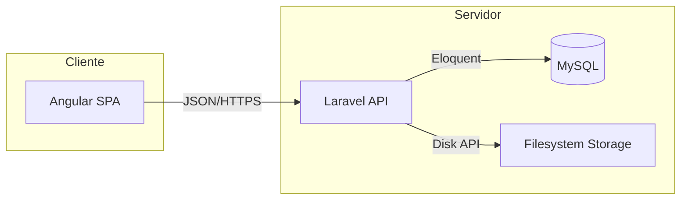

# Arquitectura del Sistema - HeavyMarket

El sistema HeavyMarket sigue un patrón de arquitectura desacoplada, separando completamente la lógica de negocio y persistencia (Backend) de la interfaz de usuario (Frontend).

## 1. Backend (heavy-api)
Construido con **Laravel 11+**, enfocado en proporcionar una API REST robusta y segura.

*   **Autenticación**: Utiliza **Laravel Sanctum** para tokens API y autenticación de estado para la Landing.
*   **Estructura de API**:
    *   `Routes`: Definidas en `api.php` bajo la versión `/v1/`.
    *   `Controllers`: Ubicados en `app/Http/Controllers/Api/V1/`, siguiendo el estándar de controladores de API.
    *   `Resources`: Uso de API Resources para respuestas JSON consistentes (`PedidoResource`, `PedidoReferenciaResource`, `ReferenciaResource`, etc.).
*   **Capa de Datos**:
    *   **Eloquent ORM**: Para la interacción con la base de datos MySQL.
    *   **Traits**: Uso de `NormalizesResources` para estandarizar el formato de textos en los modelos (Title case, uppercase para códigos, etc.).
*   **Seguridad**: Middleware `auth:sanctum` y autorización por roles (Administrador, super_admin, Vendedor, Analista, Logística).

## 2. Frontend (heavy-front)
Construido con **Angular 18+**, diseñado como una Single Page Application (SPA) modular y escalable.

*   **Estructura de Directorios**:
    *   `core/`: Servicios globales, guardias de autenticación e interceptores.
    *   `shared/`: Componentes, directivas y pipes reutilizables en toda la aplicación.
    *   `features/`: Módulos de negocio (Pedidos, Terceros, Cotizaciones) cargados mediante **Lazy Loading**.
    *   `landing/`: Lógica específica para la página pública de cara al cliente.
*   **UI Framework**: Utiliza **PrimeNG** y **PrimeBlocks** para una interfaz moderna, responsive y con soporte para temas (oscuro/claro).
*   **Gestión de Estado**: Estructura preparada para NgRx o servicios basados en Signals para la reactividad.
*   **Comunicación API**: Implementada a través de `ApiService` que centraliza las peticiones HTTP hacia el backend de Laravel.

## 3. Flujo de Referencias (Diseño Actual)

El flujo de captura de referencias en pedidos es híbrido para soportar operación comercial y calidad técnica:

1. En crear/editar pedido, el asesor usa campo con autocompletado.
2. Si existe coincidencia, se asocia `referencia_id`.
3. Si no existe, se crea referencia temporal (`es_temporal = true`) y se conserva trazabilidad por comentario de origen.
4. El analista valida la referencia en fase de análisis antes de costeo.

### Relación de datos usada para búsqueda por tipo

- Selección de tipo de artículo (`pedido_referencia.lista_id`) -> resolución de `articulo_id`.
- Búsqueda de referencias por artículo considerando:
  - FK directa: `referencias.articulo_id`.
  - Relación pivote: `articulos_referencias`.
- Fallback global por código cuando no hay coincidencias por artículo, para no bloquear captura.

## 4. Integración y Despliegue
*   **Protocolo**: Comunicación puramente JSON sobre HTTPS.
*   **CORS**: Configurado en el backend para permitir peticiones solo desde dominios autorizados.
*   **Almacenamiento**: Las imágenes de maquinaria y repuestos se gestionan a través del sistema de archivos de Laravel (`storage`), expuesto mediante enlaces simbólicos hacia `public/storage`.

## 5. Diagrama de Flujo de Alto Nivel

