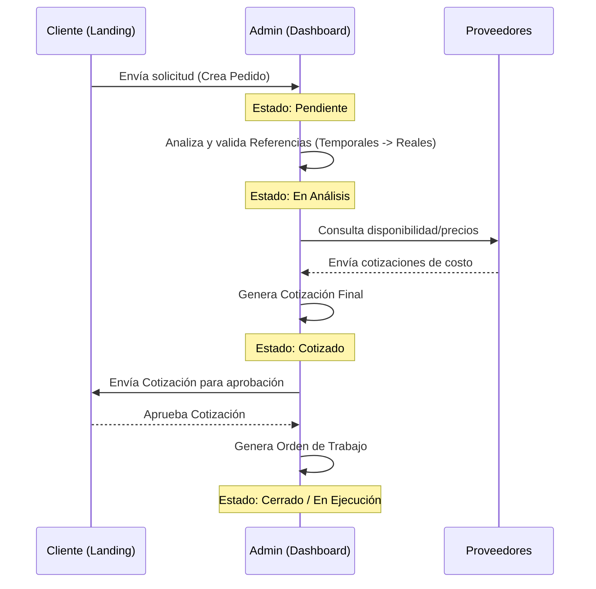

# Especificación Funcional - HeavyMarket

El sistema se divide en dos áreas principales de operación: la **Zona Pública (Landing Page)** para clientes y visitantes, y la **Zona Privada (Dashboard Admin)** para la gestión operativa.

## 1. Zona Pública (Landing Page)

Orientada a la captación de leads y servicio al cliente final.

- **Catálogo de Productos**: Navegación por categorías y subcategorías de repuestos y maquinaria.
- **Buscador Global**: Filtrado rápido de referencias y artículos por código o nombre.
- **Formulario de Cotización**: Permite a los usuarios no registrados (o registrados) solicitar cotizaciones de referencias específicas.
- **Registro y Login de Clientes**: Acceso para que los clientes consulten el estado de sus pedidos y flota de máquinas.
- **Integración Social**: Login mediante proveedores externos (Google, etc.) vía Socialite.

## 2. Zona Privada (Dashboard Administrativo)

El núcleo operativo de la empresa, protegido por roles de seguridad.

### Gestión Comercial

- **Módulo de Pedidos**: Recepción de solicitudes, asignación de máquinas y estados de análisis.
  - **Flujo de Referencias en Pedidos (Asesor/Analista)**:
    - El asesor puede escribir una referencia manual aunque no exista en catálogo.
    - El sistema sugiere referencias existentes (autocompletado) priorizando el tipo de artículo seleccionado.
    - Si no existe coincidencia, la referencia se crea como **temporal** para no bloquear el registro del pedido.
    - El analista valida y corrige posteriormente la referencia definitiva durante el análisis.
- **Proceso de Costeo**: Herramientas para comparar precios de diferentes proveedores para una misma referencia.
- **Módulo de Cotizaciones**: Generación de documentos formales para clientes con cálculo de TRM y vencimientos.
- **Órdenes de Compra/Trabajo**: Transformación de cotizaciones aprobadas en órdenes operativas.

### Gestión de Activos y Terceros

- **Directorio de Terceros**: CRM para gestionar Clientes y Proveedores, incluyendo sus contactos, direcciones y documentos legales (RUT, Certificaciones).
- **Gestión de Flotas (Máquinas)**: Registro detallado de maquinaria por serie, modelo y marca asociada a cada cliente.
- **Catálogo Técnico**: Administración centralizada de la inteligencia de producto.
  - **Artículos vs Referencias**: Un artículo agrupa múltiples referencias que son técnicamente idénticas (intercambiables o marcas alternativas).
  - **Gestión de Juegos (Kits)**: Permite definir artículos compuestos (ej. "Kit de Sellos") listando las referencias que lo integran y sus cantidades.
  - **Ficha de Medidas**: Registro de dimensiones críticas (diámetros, largos) para soporte técnico y validación de compatibilidad sin necesidad de tener la pieza física.
  - **Normalización**: Conversión automática de pesos desde **Gramos** a **Kilogramos** mediante componente especializado en la ficha de artículo, para estandarizar el cálculo de fletes en el módulo de costeo (que opera exclusivamente en KG).

### Administración y Configuración

- **Gestión de Usuarios**: Control de acceso y perfiles (Administradores, Vendedores, Super Admin).
- **Configuración de Landing**: Administración dinámica de categorías, imágenes del carrusel y contenido informativo.
- **Herramientas Auxiliares**: Gestión de TRM diaria, transportadoras y sistemas de la máquina.

## 3. Flujo de Trabajo Principal (Happy Path)

1.  **Entrada**: Un cliente solicita una pieza en la Landing Page.
2.  **Conversión**: El sistema crea un `Pedido` y notifica al administrador.
3.  **Procesamiento**: El asesor/administrador captura referencias (existentes o temporales) y el analista valida la `Referencia` correcta antes de costeo.
4.  **Cierre**: Se envía la `Cotización` al cliente; si se aprueba, se genera la `Orden de Trabajo`.



## 4. Reglas por Estado (Pedidos)

- **Nuevo**:
  - Se permite guardar pedido con información parcial.
  - Se permite captura de referencias manuales (con o sin asociación inmediata a catálogo).
- **En_Analisis**:
  - El analista completa/valida referencias, tipo de artículo, cantidades y contexto técnico.
  - Puede trabajar con referencias temporales pendientes de validación.
- **En_Costeo**:
  - Debe existir referencia válida por línea para operar costeo y comparación de proveedores.
  - El paso a costeo aplica validaciones estrictas de integridad por ítem.

## 5. Comportamiento Esperado en el Campo Referencia

- Si el usuario selecciona una sugerencia del catálogo, el sistema guarda el vínculo técnico (`referencia_id`).
- Si el usuario escribe código libre sin coincidencia, el sistema crea referencia temporal al guardar.
- La interfaz debe permitir operación continua del asesor sin bloquear captura por falta de catálogo previo.

## 6. Flujo de Costeo (Detalle Inicial)

El proceso de costeo inicia una vez el Analista de Partes ha definido los repuestos requeridos por el cliente (cantidades y detalles técnicos) y envía el pedido a costeo. En este momento, el estado del pedido cambia a **En_Costeo**.

**Objetivo:** Permitir al Asesor realizar un costeo detallado de cada referencia para seleccionar las mejores opciones (precio, tiempos de entrega) para el cliente.

**Reglas y Comportamiento del Costeo por Ítem (Referencia):**

- **Filtrado de Proveedores:** Para cada referencia, el sistema debe cargar los proveedores aplicables. Este filtro se realiza cruzando la información de la referencia con los proveedores:
  - Se deben mostrar proveedores que manejen el **Sistema** del ítem (ej. "Aire Acondicionado") y la **Marca** o Fabricante de la referencia (ej. "Caterpillar").
  - _Nota Técnica:_ Queda pendiente definir exactamente la estructura relacional en base de datos para esta asociación (Proveedor <-> Sistema <-> Marca).
- **Tipos de Proveedor:** La interfaz debe diferenciar claramente si el proveedor sugerido es **Nacional** o **Internacional**.
- **Cálculo de Precio de Venta:** En esta vista se debe realizar el cálculo del precio de venta final para el cliente (considerando costos, moneda y margen de utilidad).
- **Comparación y Selección:** Para un mismo ítem, el Asesor puede listar y comparar múltiples opciones de proveedores, evaluando principalmente sus costos y **tiempos de entrega**.
- **Generación de Cotización:** Cada opción de proveedor ingresada en la vista de costeo contará con una casilla de selección (_checkbox_). El Asesor debe marcar las opciones más viables y, a partir de estas selecciones, el sistema generará el documento formal de **Cotización**. Este documento se entregará al cliente para su decisión final.

## 7. Cotizaciones

Una cotización es el documento formal que se presenta al cliente con los precios finales de las referencias solicitadas. Se genera a partir de las opciones de proveedor seleccionadas durante el costeo.

### Estados de Cotización

| Estado       | Descripción                                                | Cómo se alcanza                      |
| ------------ | ---------------------------------------------------------- | ------------------------------------ |
| `En_Proceso` | Recién creada, referencias sin precio final                | Creación desde pedido                |
| `Borrador`   | Costeo finalizado pero falta tarifa de flete internacional | Finalizar costeo cuando falta flete  |
| `Enviada`    | Costeo completo, lista para aprobación del cliente         | Finalizar costeo con todos los datos |
| `Aprobada`   | Aprobada por el cliente o administrador                    | Acción de aprobar                    |
| `Rechazada`  | Rechazada por el cliente o administrador                   | Acción de rechazar                   |
| `Anulada`    | Anulada al devolver el pedido desde estado Cotizado        | Devolución automática                |

### Flujo de Finalización de Costeo

1. **Validación de integridad**: Cada ítem seleccionado debe tener proveedor, marca, días de entrega, costo unitario > 0, utilidad >= 0 y cantidad > 0.
2. **Verificación de fletes**: Para proveedores internacionales, debe existir tarifa de flete configurada para el país de origen. Si falta, la cotización queda en estado `Borrador` y se notifica a los administradores.
3. **Snapshot comercial**: Se crea un registro inmutable (`CotizacionReferenciaProveedor`) con los datos de cada referencia/proveedor seleccionado, preservando precios y condiciones al momento de la cotización.
4. **Cálculo de totales**: Suma de `cantidad × precio_unitario` de cada referencia, con IVA del 19% y soporte de conversión COP/USD vía TRM.

### Flujo de Aprobación (Transacción Atómica)

Al aprobar una cotización, el sistema ejecuta en una sola transacción:

1. Transita el pedido a estado `Aprobado`.
2. Marca la cotización como `Aprobada`.
3. Todas las demás cotizaciones activas del mismo pedido se marcan como `Rechazada`.
4. Crea automáticamente una **Orden de Trabajo** en estado `Pendiente`.
5. Crea automáticamente **Orden(es) de Compra** agrupadas por proveedor en estado `Pendiente de envío`.

### Cotizaciones Múltiples y Devoluciones

Un pedido en estado `Cotizado` puede tener múltiples cotizaciones (generadas en diferentes intentos de costeo). Al devolver el pedido desde `Cotizado` a `En_Costeo` o `En_Analisis`, la cotización vigente se **anula** automáticamente. Al llegar nuevamente a `Cotizado`, se crea una cotización nueva.

### Generación de PDF

Toda cotización puede exportarse a PDF incluyendo: datos del cliente, listado de referencias con precios, totales, observaciones y condiciones comerciales.

## 8. Órdenes de Compra

Las Órdenes de Compra (OC) son documentos operativos dirigidos a proveedores externos. Se crean automáticamente al aprobar una cotización, agrupando las referencias por proveedor.

### Estados de Orden de Compra

| Estado | Descripción |
| ------ | ----------- |
| `Pendiente de envío` | OC validada internamente y lista para enviarse al proveedor. |
| `Enviada` | OC enviada formalmente al proveedor. |
| `Confirmada` | Proveedor confirma aceptación de cantidades, precios y condiciones. |
| `Recibida parcialmente` | Logística registra recepción incompleta de referencias. |
| `Recibida` | Logística registra recepción completa. |
| `Cerrada` | Compra terminada formalmente, sin pendientes operativos. |
| `Cancelada` | Orden cancelada desde un estado no terminal permitido. |

### Creación Automática

Al aprobar una cotización, el sistema:

1. Agrupa las referencias aprobadas por proveedor.
2. Crea una OC por cada proveedor distinto.
3. Asigna estado `Pendiente de envío` con semáforo amarillo por defecto.
4. Vincula las referencias a cada OC con cantidades y precios de costo.

### Semáforo Visual

Cada OC tiene un campo de color para identificación rápida:

- **Amarillo** (`#FFFF00`): Pendiente de envío.
- **Azul** (`#2196F3`): Enviada.
- **Verde claro** (`#8BC34A`): Confirmada.
- **Naranja** (`#FF9800`): Recibida parcialmente.
- **Verde** (`#00ff00`): Recibida.
- **Verde oscuro** (`#4CAF50`): Cerrada.
- **Rojo** (`#ff0000`): Cancelada.

### Despacho por Proveedor

El proveedor puede confirmar la OC desde su portal cuando está `Enviada`. Después de confirmar, puede registrar el despacho ingresando guía, transportadora, fecha de despacho y observaciones. El despacho **no** es un estado formal; queda como dato logístico mientras el estado de negocio permanece en `Confirmada` hasta que Logística registre recepción.

### Endpoints Operativos

- `PATCH /api/v1/ordenes-compra/{orden_compra}/transition`: transiciones explícitas de estado.
- `POST /api/v1/ordenes-compra/{orden_compra}/receive`: recepción parcial o completa por referencia.
- `POST /api/v1/provider/purchase-orders/{id}/confirm`: confirmación de proveedor.
- `PUT /api/v1/provider/purchase-orders/{id}/dispatch`: registro de datos de despacho.

### Generación de PDF

Cada OC puede exportarse a PDF para envío formal al proveedor.

## 9. Órdenes de Trabajo

Las Órdenes de Trabajo (OT) gestionan el flujo de logística interna después de la aprobación de una cotización. Su propósito es rastrear repuestos, controlar el flujo de despacho y dar visibilidad al rol Logística.

### Estados de Orden de Trabajo

| Estado       | Descripción                             |
| ------------ | --------------------------------------- |
| `Pendiente`  | Estado inicial, repuestos por llegar    |
| `En Proceso` | En ejecución logística                  |
| `Completado` | Trabajo finalizado, despacho al cliente |
| `Cancelado`  | Orden cancelada (requiere motivo)       |

### Estados de Referencia Individual (Semáforo)

Cada referencia dentro de una OT tiene su propio estado para semaforización:

| Estado       | Color | Significado                                   |
| ------------ | ----- | --------------------------------------------- |
| `Pendiente`  | Rojo  | Referencia pendiente de recibir del proveedor |
| `Recibido`   | Verde | Referencia recibida en almacén                |
| `Despachado` | Azul  | Referencia despachada al cliente              |
| `Cancelado`  | Gris  | Referencia cancelada                          |

### Flujo Logístico

1. **Creación automática**: Al aprobar cotización, se crea OT con todas las referencias del pedido en estado `Pendiente`.
2. **Monitoreo**: Logística verifica si cada repuesto llegó del proveedor (verde), está en tránsito (amarillo) o no llegará (rojo).
3. **Despacho**: Cuando todos los ítems están en verde, se despacha al cliente vía transportadora.
4. **Cierre**: Se confirma entrega y la OT pasa a `Completado`.

### Campos Clave

- `fecha_ingreso` y `fecha_entrega`: Fechas estimadas de logística.
- `direccion_id`: Dirección de entrega del cliente.
- `transportadora_id`: Empresa de transporte seleccionada.
- `guia`: Número de guía del despacho.
- `motivo_cancelacion`: Obligatorio si se cancela la OT.

## 10. Portal de Proveedores

El Portal de Proveedores transforma a los proveedores de registros pasivos a colaboradores activos en el proceso de costeo.

### Autenticación y Acceso

- **Mecanismo**: Login vía `ProviderAuthController` con flag `provider_access` activado en el Tercero.
- **Rol requerido**: `Proveedor` (Spatie).
- **Regla de oro**: `tipo = Proveedor` en Tercero **no** implica automáticamente acceso al portal. El administrador debe activar explícitamente `provider_access`.

### Especialización del Proveedor

Un proveedor solo ve referencias que coincidan con su perfil:

- **Marcas/Fabricantes** que maneja (tabla `tercero_fabricantes`).
- **Categorías Comerciales** que atiende (tabla `tercero_categoria_comercial`).

### Motor de Emparejamiento (Matching Engine)

Cuando un pedido pasa a `En_Costeo`, el sistema activa el matching:

| Modo       | Descripción                                                                               |
| ---------- | ----------------------------------------------------------------------------------------- |
| `pending`  | Referencias en costeo que coinciden con el perfil del proveedor y que aún no ha costeadas |
| `sent`     | Costeos enviados por el proveedor pendientes de selección por el asesor                   |
| `approved` | Costeos del proveedor que fueron seleccionados/aprobados                                  |

### Privacidad del Proveedor

- No ve quién es el cliente.
- No ve el pedido completo.
- No ve precios de otros proveedores.
- Solo ve referencias individuales que coinciden con su especialización.

### Envío de Costeo

El proveedor ingresa por cada referencia:

- **Precio de costo** (moneda base).
- **Marca sugerida** (puede proponer alternativa si la solicitada no está disponible).
- **Días de entrega** (lead time estimado).
- **Es backorder** (si aplica, días de entrega se guarda como null).
- **Comentario** opcional.

### Clasificación Automática

- **Nacional**: Si el proveedor tiene `country_id = 48` (Colombia).
- **Internacional**: Cualquier otro país.
- **Tipo de entrega**: Backorder, Inmediata o Programada.

### Gestión de Órdenes de Compra

El proveedor puede:

1. Ver sus OCs asignadas.
2. Registrar despacho con guía, transportadora y fecha.
3. La OC transiciona automáticamente a `Despachado`.

## 11. Gestión de Terceros (CRM)

Los Terceros son la entidad núcleo del sistema. Representan a cualquier actor comercial: Clientes, Proveedores o ambos.

### Tipos de Tercero

| Tipo        | Descripción                                    |
| ----------- | ---------------------------------------------- |
| `Cliente`   | Solicita pedidos y recibe cotizaciones         |
| `Proveedor` | Participa en costeo y recibe órdenes de compra |
| `Ambos`     | Actúa como cliente y proveedor simultáneamente |

### Datos Asociados

Cada Tercero puede tener:

- **Contactos** (1:N): Personas de contacto con nombre, cargo, teléfono, email.
- **Direcciones** (1:N): Direcciones físicas con tipo (oficina, bodega, obra).
- **Máquinas** (N:M): Flota de maquinaria asociada (solo clientes).
- **Sistemas** (N:M): Sistemas de máquina que maneja.
- **Fabricantes/Marcas** (N:M): Marcas que representa o consume.
- **Documentos legales**: RUT, certificaciones (upload de archivos).

### Accesos al Sistema

| Acceso               | Campo                    | Rol Spatie  | Descripción                          |
| -------------------- | ------------------------ | ----------- | ------------------------------------ |
| Landing (clientes)   | `landing_access = true`  | `Cliente`   | Consulta de pedidos y flota propia   |
| Portal (proveedores) | `provider_access = true` | `Proveedor` | Costeo colaborativo y gestión de OCs |

### Flujo de Creación de Usuarios

Al activar acceso desde el CRUD administrativo:

1. Si es **Cliente**: Se crea User con rol `Cliente` vía `ClientAuthController`.
2. Si es **Proveedor**: Se crea User con rol `Proveedor` + `provider_access = true` vía `ProviderAuthController`.
3. Si es **Ambos**: Se crean ambos accesos.

## 12. Gestión de Flotas (Máquinas)

El módulo de Máquinas registra la flota de maquinaria pesada asociada a cada cliente, permitiendo contextualizar los pedidos técnicamente.

### Datos de la Máquina

- **Serie**: Identificador único del equipo (número de serie/chasis).
- **Modelo**: Modelo comercial (ej. "320D", "D6T").
- **Tipo de Máquina**: Categoría funcional (ej. "Excavadora", "Bulldozer").
- **Marca/Fabricante**: Fabricante original (ej. "Caterpillar", "Komatsu").
- **Cliente (Tercero)**: Propietario de la máquina.
- **Arreglo**: Configuración técnica específica.

### Componentes de Máquina

Cada máquina puede tener componentes registrados que detallan sus sistemas y subsistemas técnicos, facilitando la identificación de repuestos compatibles.

### Asociación con Pedidos

Todo pedido se asocia a una máquina específica del cliente. Esto permite:

- Filtrar referencias compatibles con el modelo/sistema.
- Historial de mantenimiento por equipo.
- Contexto técnico para el analista durante la validación.

## 13. Dashboard y Métricas

El Dashboard proporciona una vista ejecutiva del estado operativo del negocio.

### Métricas Disponibles

| Métrica                      | Descripción                                        | Cálculo                                                   |
| ---------------------------- | -------------------------------------------------- | --------------------------------------------------------- |
| **Conteos globales**         | Pedidos, cotizaciones, terceros, órdenes de compra | Conteo directo de registros                               |
| **Flujo de ingresos**        | Ingresos de los últimos 6 meses                    | Suma de `valor_total` de órdenes de compra por mes        |
| **Referencias más vendidas** | Top 5 referencias por valor                        | Suma de `valor_total` en órdenes de compra por referencia |
| **Actividad reciente**       | Últimas 10 acciones del sistema                    | Mezcla cronológica de pedidos, cotizaciones y órdenes     |

### Filtrado por Rol

- **Super Admin / Administrador**: Ve todos los datos del sistema.
- **Analista**: Solo ve pedidos en estado `En_Analisis`.
- **Vendedor / Otros roles**: Solo ven datos propios (`user_id` del registro).

### Widgets del Frontend

- Stats cards (contadores rápidos).
- Gráfico de flujo de ingresos (barras mensuales).
- Tabla de referencias más vendidas.
- Panel de notificaciones de actividad.

## 14. Sistema de Notificaciones

El sistema gestiona notificaciones internas para mantener informados a los usuarios sobre eventos relevantes.

### Tipos de Notificaciones

| Tipo                   | Origen                                         | Destinatarios   |
| ---------------------- | ---------------------------------------------- | --------------- |
| `freight_rate_request` | Solicitud de tarifa de flete desde costeo      | Administradores |
| `missing_freight_rate` | Flete no configurado al finalizar costeo       | Administradores |
| `pedido_creado`        | Nuevo pedido registrado (virtual, dashboard)   | Según rol       |
| `cotizacion_nueva`     | Nueva cotización generada (virtual, dashboard) | Según rol       |
| `orden_confirmada`     | OC confirmada (virtual, dashboard)             | Según rol       |

### Funcionalidades

- **Listado paginado**: 20 notificaciones por página.
- **Conteo de no leídas**: Badge en la interfaz.
- **Marcar como leída**: Individual o masiva.
- **Eliminación**: Borrado de notificaciones antiguas.

### Notificaciones por Email

El sistema envía emails automáticos en eventos clave:

- **QuoteRequestedClient**: Confirmación al cliente que solicitó cotización.
- **QuoteRequestedAdmin**: Alerta a comercial@heavymarket.net sobre nueva solicitud.
- **NewContactLead**: Alerta sobre nuevo lead de contacto.

## 15. Búsqueda Global

El buscador global permite encontrar rápidamente cualquier entidad del sistema desde una barra de búsqueda unificada.

### Entidades Buscables

| Entidad      | Campos de búsqueda                 | Resultados máximos |
| ------------ | ---------------------------------- | ------------------ |
| Pedidos      | ID, estado                         | 5                  |
| Terceros     | Nombre, número de documento        | 5                  |
| Cotizaciones | ID                                 | 5                  |
| Artículos    | Definición, descripción específica | 5                  |
| Máquinas     | Modelo, serie, arreglo             | 5                  |
| Referencias  | Código de referencia, comentario   | 5                  |
| Listas       | Nombre                             | 5                  |
| Sistemas     | Nombre                             | 5                  |
| Fabricantes  | Nombre                             | 5                  |

### Reglas de Búsqueda

- Término mínimo: 2 caracteres.
- Búsqueda parcial con `LIKE %query%`.
- Máximo 45 resultados totales (5 por entidad).
- Cada resultado incluye: ID, título, descripción, tipo y ruta de navegación en el SPA.

## 16. Administración de Landing

El panel administrativo permite gestionar dinámicamente el contenido de la Landing Page pública.

### Categorías y Subcategorías

- **Categorías**: Nombre, descripción general, orden en navbar, estado (activo/inactivo), mostrar en navbar.
- **Subcategorías**: Nombre, descripción, imagen (máx 5MB), orden, estado, categoría padre.
- **Ordenamiento**: Por `updated_at desc` y luego `nombre asc`.

### Marcas con Logos

- Gestión de fabricantes/marcas visibles en landing.
- Upload de logos con resize automático (parámetros `w` y `h`).
- Optimización de imágenes para carga rápida.

### Leads de Contacto

- Formulario público de contacto genera leads.
- Estados del lead: `nuevo`, `contactado`, `descartado`.
- El listado excluye emails ya registrados como Tercero.
- Notificación automática a comercial@heavymarket.net por cada nuevo lead.

### Cotización desde Landing

El formulario público de cotización:

1. Determina el tercero: usuario autenticado, búsqueda por email, o creación de nuevo Tercero.
2. Busca o crea la Máquina por serie.
3. Crea un Pedido con `origen = Landing` y `estado = Nuevo`.
4. Procesa ítems: busca/crea Referencias (marca `es_temporal = true` si son manuales).
5. Envía emails de confirmación al cliente y al equipo comercial.

### Cacheo

Los endpoints públicos usan `Cache-Control: public, max-age=300, stale-while-revalidate=60` para optimizar rendimiento.

## 17. Gestión de Fletes por País

El módulo de países gestiona las tarifas de flete internacional necesarias para el costeo de proveedores extranjeros.

### Configuración por País

- **Flete**: Tarifa en USD por libra (rango 0-100).
- **Estado activo**: Habilita/deshabilita el país para costeo.

### Solicitud de Flete

Cuando un asesor encuentra un proveedor de un país sin tarifa configurada:

1. El sistema permite solicitar configuración de flete.
2. Se valida que el proveedor pertenezca al país indicado.
3. Se notifica a todos los administradores con los datos: país, flete solicitado, proveedor y pedido.
4. El administrador configura la tarifa desde el módulo de países.

### País Nacional

Colombia (`country_id = 48`) se considera proveedor nacional. Cualquier otro país es internacional y requiere tarifa de flete para costeo completo.

## 18. Roles y Control de Acceso

El sistema utiliza Spatie Permission para gestión de roles. Todo el control de acceso se basa en roles (no en permisos granulares).

### Roles Definidos

| Rol             | Descripción               | Acceso Principal                                     |
| --------------- | ------------------------- | ---------------------------------------------------- |
| `super_admin`   | Super administrador       | Acceso total sin restricciones                       |
| `Administrador` | Administrador             | Acceso total al sistema interno                      |
| `Vendedor`      | Asesor comercial          | Gestiona sus propios pedidos, terceros, cotizaciones |
| `Analista`      | Analista de partes/costeo | Solo ve pedidos en estado `En_Analisis`              |
| `Logistica`     | Operador logístico        | Ve cotizaciones, órdenes; acceso de lectura amplio   |
| `Cliente`       | Cliente externo (landing) | Portal de clientes, cotizaciones propias             |
| `Proveedor`     | Proveedor externo         | Portal de proveedores (matching, costeo, despachos)  |
| `panel_user`    | Usuario de panel          | Acceso de lectura a catálogos                        |

### Matriz de Acceso por Módulo

| Módulo           | super_admin | Admin | Vendedor       | Analista          | Logistica | Cliente     | Proveedor     |
| ---------------- | ----------- | ----- | -------------- | ----------------- | --------- | ----------- | ------------- |
| Pedidos          | CRUD        | CRUD  | CRUD (propios) | R+U (En_Analisis) | R         | -           | -             |
| Cotizaciones     | CRUD        | CRUD  | R (propias)    | R (En_Analisis)   | R         | R (propias) | -             |
| Órdenes Compra   | CRUD        | CRUD  | CRUD           | R                 | R         | -           | R+U (propias) |
| Órdenes Trabajo  | CRUD        | CRUD  | R              | -                 | CRUD      | -           | -             |
| Terceros         | CRUD        | CRUD  | CRUD           | -                 | R         | R (propio)  | R (propio)    |
| Artículos        | CRUD        | CRUD  | CRUD           | CRUD              | R         | R           | R             |
| Referencias      | CRUD        | CRUD  | CRUD           | CRUD              | R         | R           | R             |
| Máquinas         | CRUD        | CRUD  | CRUD           | CRUD              | R         | R (propias) | -             |
| Listas/Catálogos | CRUD        | CRUD  | CRUD           | CRUD              | R         | R           | R             |
| Usuarios         | CRUD        | CRUD  | -              | -                 | -         | -           | -             |
| Landing Admin    | CRUD        | CRUD  | -              | -                 | -         | -           | -             |
| Países/Fletes    | CRUD        | CRUD  | -              | -                 | -         | -           | -             |
| Portal Proveedor | -           | -     | -              | -                 | -         | -           | CRUD          |

### Restricciones Especiales

- **Vendedor**: Solo ve sus propios registros (filtrado por `user_id`).
- **Analista**: Solo ve pedidos en estado `En_Analisis`, independientemente del propietario.
- **Logistica**: No puede crear pedidos ni cotizaciones, solo gestionar órdenes.
- **Cliente/Proveedor**: Solo acceden a sus portales respectivos, no al dashboard administrativo.

## 19. Estados y Transiciones Completas

### Pedidos (10 estados)

```
Borrador    --> Nuevo, En_Analisis, Cancelado
Nuevo       --> En_Analisis, En_Costeo, Cancelado
En_Analisis --> En_Costeo, Cotizado, Nuevo (devolver), Cancelado
En_Costeo   --> Cotizado, Aprobado, En_Analisis (devolver), Cancelado
Cotizado    --> Aprobado, Rechazado, Cancelado, En_Costeo (recosteo), En_Analisis (cambio alcance)
Aprobado    --> Enviado, Cancelado
Enviado     --> Entregado, Cancelado
Entregado   --> (FINAL - sin transiciones)
Rechazado   --> (FINAL - sin transiciones)
Cancelado   --> (FINAL - sin transiciones)
```

**Estados iniciales** (creación directa): `Borrador`, `Nuevo`, `En_Analisis`.

**Requisito de máquina revisada**: Solo `En_Analisis` requiere que la máquina esté revisada para transitar.

### Cotizaciones (6 estados)

```
En_Proceso --> Borrador (falta flete) | Enviada (todo OK)
Borrador   --> Aprobada | Rechazada
Enviada    --> Aprobada | Rechazada
Cualquier activa --> Anulada (devolución desde Cotizado)
```

### Órdenes de Compra (5 estados)

```
Pendiente --> En proceso --> Despachado --> Entregado
Cualquiera --> Cancelado
```

### Órdenes de Trabajo (4 estados)

```
Pendiente --> En Proceso --> Completado
Cualquiera --> Cancelado (requiere motivo)
```

### Referencias en Orden de Trabajo (4 estados)

```
Pendiente --> Recibido --> Despachado
Cualquiera --> Cancelado
```

## 20. Herramientas Auxiliares

### TRM (Tasa Representativa del Mercado)

- Registro diario de la tasa de cambio COP/USD.
- Valor por defecto: 4000 COP/USD si no hay registro vigente.
- Integración con API externa para actualización automática.
- Uso en cálculos de costeo internacional y conversión de precios.

### Transportadoras

- Directorio de empresas de transporte.
- Asociación con despachos de Órdenes de Trabajo.
- Campos: nombre, contacto, teléfono, dirección, tipo (nacional/internacional).

### Sistemas de Máquina

- Catálogo de sistemas funcionales (ej. "Motor", "Hidráulico", "Aire Acondicionado").
- Asociación con tipos de artículo para filtrado de catálogo.
- Sincronización de tipos de artículo por sistema.

### Listas Dinámicas (Catálogos Polimórficos)

El sistema utiliza una entidad `Lista` polimórfica para gestionar múltiples catálogos:

| Tipo de Lista          | Uso                                                   |
| ---------------------- | ----------------------------------------------------- |
| Tipos de Máquina       | Clasificación funcional (Excavadora, Bulldozer, etc.) |
| Marcas/Fabricantes     | Fabricantes de equipos y repuestos                    |
| Categorías Comerciales | Agrupación comercial para matching de proveedores     |
| Tipos de Artículo      | Clasificación de repuestos                            |
| Piezas Estándar        | Definiciones normalizadas de artículos                |
| Tipos de Medida        | Clasificación de dimensiones técnicas                 |
| Unidades de Medida     | mm, cm, pulgadas, etc.                                |

## 21. Módulos Pendientes / Futuros

Los siguientes módulos o funcionalidades están identificados pero aún no implementados:

| Módulo                     | Estado          | Descripción                                                               |
| -------------------------- | --------------- | ------------------------------------------------------------------------- |
| Portal del Cliente         | Parcial         | Auth existe, pero no hay feature dedicado de "mis pedidos / mis máquinas" |
| Chat/Mensajería            | Models existen  | Integración con paquete de chat no expuesta en UI                         |
| Historial de cambios en OT | Pendiente       | Auditoría de cambios de estado en referencias                             |
| Importación masiva         | No implementado | Sin endpoints de importación CSV/Excel                                    |
| Reportes avanzados         | No implementado | Solo dashboard básico, sin exportación masiva                             |
| Facturación electrónica    | No implementado | Sin integración con DIAN                                                  |
| Módulo de pagos            | No implementado | Sin registro de pagos ni cuentas por cobrar                               |
| Webhooks/API externa       | No implementado | Sin endpoints de notificación a sistemas externos                         |

## Recepciones de compra

La recepción de compra es el subdocumento que evidencia la llegada física de mercancía desde proveedor. Se registra desde la Orden de Trabajo por Logística y se relaciona con la Orden de Compra correspondiente.

Campos principales:

- Orden de Trabajo.
- Orden de Compra.
- Usuario receptor.
- Fecha de recepción.
- Número de remisión.
- Observaciones.
- Líneas con cantidad recibida, conforme, rechazada y motivo de rechazo.

Reglas:

- `cantidad_recibida = cantidad_conforme + cantidad_rechazada`.
- Si existe cantidad rechazada, el motivo es obligatorio.
- La cantidad conforme acumulada no puede superar la cantidad ordenada.
- La OC se actualiza automáticamente a `Recibida parcialmente` o `Recibida` según los acumulados conformes.
