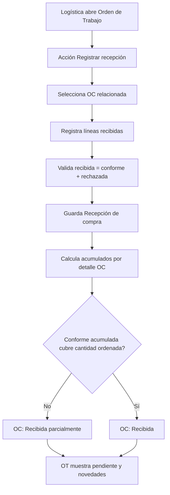

# feat: Registrar recepciones de compra desde Orden de Trabajo

**Tipo:** Feature / Ajuste arquitectónico  
**Prioridad:** Alta  
**Módulo:** Órdenes de Trabajo + Órdenes de Compra + Logística  
**Issue relacionado:** `feat-orden-compra-estados`

---

## Contexto

La recepción física de repuestos no debe operarse desde la Orden de Compra. La OC expresa lo solicitado al proveedor: cantidades, precios, proveedor, condiciones y fecha esperada. Quien recibe y verifica físicamente los repuestos es Logística, y su tablero operativo es la Orden de Trabajo.

Por eso, Logística debe iniciar la acción **Registrar recepción** desde la OT. Sin embargo, las cantidades recibidas no deben guardarse como un campo editable directo dentro de la OC o de sus detalles. Cada recepción debe quedar como evidencia auditable de un evento físico.

---

## Decisión funcional

El personal de Logística registrará las cantidades recibidas desde la Orden de Trabajo mediante una acción **Registrar recepción**. Cada recepción quedará asociada a:

- La Orden de Trabajo.
- La Orden de Compra.
- Las líneas/detalles de la OC recibidas.
- El usuario que recibió físicamente la mercancía.

Las recepciones registradas no se editarán. Cualquier corrección se hará mediante anulación auditada o un movimiento de ajuste posterior.

---

## Responsabilidad por documento

### Orden de Compra

Expresa lo solicitado al proveedor:

- Cantidad ordenada.
- Precio.
- Proveedor.
- Condiciones.
- Fecha esperada.

### Orden de Trabajo

Es el tablero operativo de Logística:

- Qué debe llegar.
- Qué ya llegó.
- Qué falta.
- Qué tiene novedades.
- Qué está listo para enviar al cliente.

### Recepción de compra

Es la evidencia del evento físico:

- Qué llegó.
- Cuándo llegó.
- Quién lo recibió.
- En qué cantidad.
- En qué condiciones.

---

## Modelo relacional propuesto

```text
Pedido
└── Orden de Trabajo
    ├── Recepción 1
    │   └── Líneas recibidas
    └── Recepción 2
        └── Líneas recibidas

Orden de Compra
└── Detalles de OC
    └── Líneas de recepción
```

### Tablas nuevas

#### `recepciones_compra`

| Campo | Tipo | Regla |
|-------|------|-------|
| `id` | bigint | PK |
| `orden_trabajo_id` | foreignId | Requerido, FK a `orden_trabajos` |
| `orden_compra_id` | foreignId | Requerido, FK a `orden_compras` |
| `recibido_por` | foreignId | Requerido, FK a `users` |
| `fecha_recepcion` | datetime | Requerido |
| `numero_remision` | string nullable | Documento/remisión del proveedor |
| `observaciones` | text nullable | Observaciones generales |
| `estado` | string | `Activa` por defecto; permite `Anulada` en correcciones auditadas |
| `anulada_por` | foreignId nullable | Usuario que anula |
| `fecha_anulacion` | datetime nullable | Momento de anulación |
| `motivo_anulacion` | text nullable | Motivo obligatorio al anular |
| timestamps | timestamps | Auditoría estándar |

#### `recepcion_compra_detalles`

| Campo | Tipo | Regla |
|-------|------|-------|
| `id` | bigint | PK |
| `recepcion_compra_id` | foreignId | Requerido, FK a `recepciones_compra` |
| `orden_compra_detalle_id` | foreignId | Requerido, FK a `orden_compra_referencia.id` |
| `cantidad_recibida` | integer | Requerido, mínimo 0 |
| `cantidad_conforme` | integer | Requerido, mínimo 0 |
| `cantidad_rechazada` | integer | Requerido, mínimo 0 |
| `motivo_rechazo` | text nullable | Obligatorio si `cantidad_rechazada > 0` |
| timestamps | timestamps | Auditoría estándar |

### Restricciones de validación

- `cantidad_recibida = cantidad_conforme + cantidad_rechazada`.
- No se permite registrar una línea sin cantidad recibida positiva.
- No se permite que la cantidad conforme acumulada activa exceda la cantidad ordenada, salvo que exista una regla explícita de sobreentrega aprobada. Para este issue, no se permite sobreentrega.
- El detalle recibido debe pertenecer a la OC indicada.
- La OC debe pertenecer al mismo pedido/cotización de la OT o estar relacionada por el pedido origen.
- Solo usuarios de Logística/Admin pueden registrar recepciones.

---

## Cálculo de cantidades

Para cada línea de OC:

```text
cantidad_ordenada = orden_compra_referencia.cantidad
cantidad_recibida_fisica = SUM(cantidad_recibida de recepciones activas)
cantidad_conforme = SUM(cantidad_conforme de recepciones activas)
cantidad_rechazada = SUM(cantidad_rechazada de recepciones activas)
cantidad_pendiente = cantidad_ordenada - cantidad_conforme
```

La cantidad rechazada cuenta como evidencia de llegada física, pero no cierra la obligación de compra. La OC se considera completa solo cuando la cantidad conforme cubre la cantidad ordenada, o cuando se cancele formalmente el saldo pendiente.

---

## Actualización automática de estado de OC

El estado de la OC no debe cambiarlo manualmente Logística mediante selector al recibir mercancía. El sistema recalcula el estado al registrar una recepción activa:

```text
sin recepciones activas
→ mantiene Enviada o Confirmada

cantidad recibida física > 0 y cantidad conforme acumulada < cantidad ordenada
→ Recibida parcialmente

cantidad conforme acumulada = cantidad ordenada
→ Recibida

Recibida sin novedades pendientes
→ Cerrada mediante acción formal posterior
```

Si hay recepción física con rechazos y ninguna unidad conforme, la OC queda en `Recibida parcialmente` porque existe evento físico con novedad, pero conserva saldo pendiente.

---

## Flujo operativo



---

## Requerimientos técnicos

### Backend

1. Crear modelos `RecepcionCompra` y `RecepcionCompraDetalle`.
2. Crear migración para `recepciones_compra` y `recepcion_compra_detalles` con FKs e índices.
3. Remover `cantidad_recibida` como fuente de verdad en `orden_compra_referencia`; si la migración previa todavía no fue desplegada, dejar de crear esa columna. Si ya existe en un entorno, tratarla como campo legacy no editable o retirarla con migración defensiva.
4. Crear `StoreRecepcionCompraRequest` con validación estricta de cantidades.
5. Crear `RecepcionCompraResource` y `RecepcionCompraDetalleResource`.
6. Crear `RecepcionCompraService` transaccional para:
   - Validar relación OT ↔ OC.
   - Validar líneas de OC.
   - Guardar cabecera y detalles.
   - Recalcular acumulados.
   - Actualizar estado de OC mediante `OrdenCompraLifecycleService` o un método interno dedicado de recálculo.
7. Agregar endpoint:
   - `POST /api/v1/ordenes-trabajo/{orden_trabajo}/recepciones-compra`
8. Agregar endpoint de contexto si la UI lo requiere:
   - `GET /api/v1/ordenes-trabajo/{orden_trabajo}/recepciones-compra/contexto`
9. Actualizar `OrdenTrabajoResource` para exponer recepciones y/o resumen logístico sin N+1.
10. Ajustar tests backend de recepción para validar múltiples recepciones acumuladas, rechazos y actualización automática de estado OC.

### Frontend

1. Crear modelos estrictos para `RecepcionCompra`, `RecepcionCompraDetalle`, DTOs de creación y resumen acumulado.
2. Agregar métodos en `OrdenTrabajoService` o un servicio dedicado para registrar recepción y consultar contexto.
3. En detalle de OT, agregar acción **Registrar recepción** visible para Logística/Admin.
4. Crear modal de recepción con:
   - Selección de OC relacionada.
   - Líneas de la OC.
   - Cantidad ordenada, conforme acumulada, pendiente y rechazada acumulada.
   - Campos: recibida, conforme, rechazada, motivo rechazo.
   - Validación visual de `recibida = conforme + rechazada`.
5. Tras guardar, refrescar OT y OCs relacionadas.
6. Retirar de la vista de detalle de OC cualquier flujo de recepción editable directa; la OC debe mostrar resumen/acumulados, no capturar recepción.

### Documentación

Actualizar:

- `docs/issues/feat-orden-compra-estados.md` para indicar que el endpoint `receive` directo de OC queda reemplazado por recepción desde OT.
- `docs/modulo_ordenes_compra.md` con la responsabilidad documental.
- `docs/modulo_pedidos.md` con el flujo OT como centro de trabajo logístico.
- `docs/especificacion_funcional.md` con el nuevo subdocumento Recepción de compra.

---

## Criterios de aceptación

- [ ] Logística puede abrir una OT y ejecutar **Registrar recepción**.
- [ ] Cada recepción crea una cabecera en `recepciones_compra` y líneas en `recepcion_compra_detalles`.
- [ ] La recepción queda relacionada a OT, OC, usuario receptor y líneas de OC.
- [ ] No se edita `cantidad_recibida` directamente en la OC.
- [ ] El sistema calcula acumulados por línea: recibido físico, conforme, rechazado y pendiente.
- [ ] Una entrega parcial actualiza la OC a `Recibida parcialmente`.
- [ ] Una entrega completa conforme actualiza la OC a `Recibida`.
- [ ] Una recepción con rechazo mantiene saldo pendiente hasta reposición, ajuste o cancelación formal.
- [ ] Las recepciones registradas no se editan; solo se anulan o ajustan con auditoría.
- [ ] Tests backend cubren recepción parcial, completa, rechazo y segunda recepción acumulada.
- [ ] Tests frontend cubren validaciones del modal y visibilidad por rol.

---

## Mapa de implementación

### Backend

```text
heavy-api/app/
├── Models/
│   ├── RecepcionCompra.php
│   └── RecepcionCompraDetalle.php
├── Http/
│   ├── Controllers/Api/V1/OrdenTrabajoController.php
│   ├── Requests/StoreRecepcionCompraRequest.php
│   └── Resources/
│       ├── RecepcionCompraResource.php
│       └── RecepcionCompraDetalleResource.php
├── Services/
│   ├── RecepcionCompraService.php
│   └── OrdenCompraLifecycleService.php
└── routes/api.php
```

### Frontend

```text
heavy-front/src/app/
├── core/models/
│   ├── orden-trabajo.model.ts
│   └── recepcion-compra.model.ts
├── core/services/
│   └── orden-trabajo.service.ts
├── features/ordenes-trabajo/detail/detail.component.ts
└── store/ordenes-trabajo/
    ├── actions/ordenes-trabajo.actions.ts
    ├── effects/ordenes-trabajo.effects.ts
    └── reducers/ordenes-trabajo.reducer.ts
```
