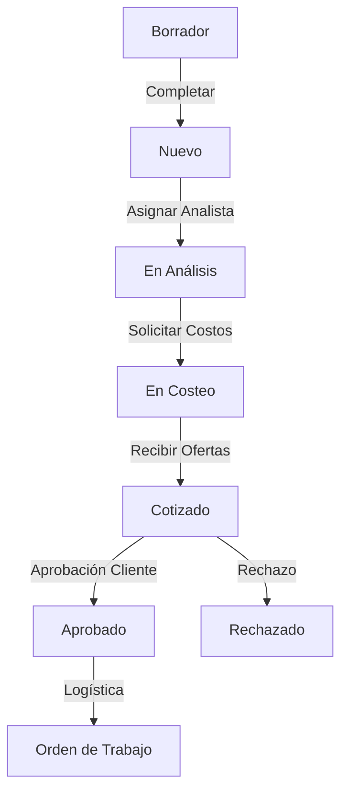

# Módulo de Pedidos y Cotizaciones

Este módulo gestiona el corazón comercial de HeavyMarket: desde la intención de compra del cliente hasta la generación de la cotización formal.

## 1. Flujo de Trabajo (Workflow)

## 2. Características Clave
- **Wizard de Creación**: Proceso guiado para asociar cliente, máquinas y referencias.
- **Análisis de Referencias**: Limpieza y validación de ítems antes de enviar a proveedores.
- **Cuadro Comparativo**: Selección inteligente del mejor proveedor por precio y tiempo.
- **TRM Dinámica**: Conversión automática de precios basada en la tasa del día.

---

## 🛠️ Mapa de Implementación (Anclas Técnicas)

Para dominar el flujo de Pedidos y Cotizaciones, consulte estos archivos:

1. **El Contrato (Backend Model)**: 
   - `heavy-api/app/Models/Pedido.php` (Estados y trazabilidad).
   - `heavy-api/app/Models/Cotizacion.php` (Resultante del proceso de costeo).
2. **El Cerebro (API Controller)**: 
   - `heavy-api/app/Http/Controllers/Api/V1/PedidoController.php` (Orquestador del flujo).
   - `heavy-api/app/Http/Controllers/Api/V1/CotizacionController.php` (Generación de PDFs y aprobación).
3. **El Transporte (Frontend DTO)**: `heavy-front/src/app/core/models/pedido.model.ts` (Interfaces complejas con referencias anidadas).
4. **La Fachada (State Management)**: `heavy-front/src/app/store/pedidos/` (Efectos y reducers para el flujo multi-paso).
5. **La Interacción (Feature UI)**: 
   - `heavy-front/src/app/features/pedidos/analysis/` (Pantalla de limpieza de datos).
   - `heavy-front/src/app/features/cotizaciones/` (Gestión de documentos finales).

---

## 3. Matriz Estado x Rol (Documento Vivo)

### Convenciones de Nomenclatura
- Estados del enum backend: `Borrador`, `Nuevo`, `En_Analisis`, `Enviado`, `En_Costeo`, `Cotizado`, `Aprobado`, `Entregado`, `Rechazado`, `Cancelado`.
- En templates se usa el valor exacto del enum (ej. `pedido.estado !== 'Nuevo'`).
- Roles: `Vendedor`, `Analista`, `Administrador`, `super_admin`, `Logistica`.

---

### Estado: Nuevo

**Descripcion**: Pedido completado y listo para ser asignado a un analista. Es el primer estado formal tras salir de Borrador.

#### Vista Detalle (`detail.html` / `detail.ts`)

| Elemento | Comportamiento | Justificacion |
|----------|---------------|---------------|
| Boton Imprimir | Oculto | Prematuro; el pedido aun no tiene cotizacion ni analisis |
| Boton Generar Cotizacion (sidebar) | Oculto | Decorativo sin handler; la cotizacion se genera tras el costeo |
| Boton Analizar Pedido | Visible para Analista/Admin | Permite transicion a En_Analisis |
| Boton Costear Pedido | Visible para Vendedor/Admin si estado = En_Costeo | No aplica en Nuevo, pero el boton existe para otros estados |
| Boton Editar Pedido | Visible segun `puedeEditarPedido()` | Vendedor puede editar si no esta en En_Analisis |
| Fallback "Item Requerido #N" | Usa `$index + 1` (posicion en lista) | El PK `item.id` era confuso; la posicion ordinal es mas legible |

#### Reglas de Rol en Estado Nuevo

| Rol | Ver Detalle | Editar | Analizar | Costear |
|-----|------------|--------|----------|---------|
| Vendedor | Si (solo propios) | Si | No | No |
| Analista | Si | No | Si | No |
| Administrador | Si | Si | Si | Si |
| super_admin | Si | Si | Si | Si |
| Logistica | Si | Si | No | No |

#### Archivos Afectados
- `heavy-front/src/app/features/pedidos/detail/detail.html`
- `heavy-front/src/app/features/pedidos/detail/detail.ts`

---

### Estado: En_Analisis

**Descripcion**: Pedido asignado al analista para limpieza y validacion de referencias. El vendedor consulta en detalle (solo lectura); el analista trabaja en la ruta `/analysis`.

#### Vista Detalle (`detail.html` / `detail.ts`) — consulta durante analisis

| Elemento | Comportamiento | Justificacion |
|----------|---------------|---------------|
| Boton Imprimir | Oculto | Aun no hay cotizacion; el pedido esta en revision |
| Boton Generar Cotizacion (sidebar) | Oculto | Decorativo sin handler; cotizacion se genera tras costeo |
| Boton Analizar Pedido | Visible para Analista/Admin | Acceso a la vista de trabajo `/analysis` |
| Boton Editar Pedido | Segun `puedeEditarPedido()` | Vendedor bloqueado; admin/logistica pueden mutar |

#### Vista Analisis (`analysis.html`)

| Elemento | Comportamiento | Justificacion |
|----------|---------------|---------------|
| Boton Imprimir | No existe en plantilla | N/A |
| Boton Generar Cotizacion | No existe en plantilla | N/A |
| Guardar / Pasar a costeo / Devolver | Segun rol y completitud de items | Flujo operativo del analista |

#### Archivos Afectados
- `heavy-front/src/app/features/pedidos/detail/detail.html`
- `heavy-front/src/app/features/pedidos/detail/detail.ts`

---

**Última actualización:** 13 de Junio, 2026
