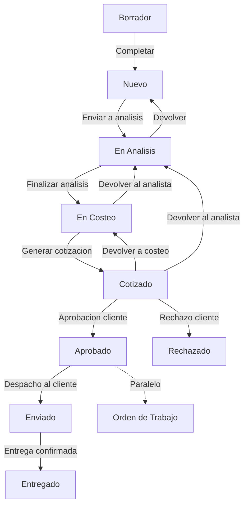
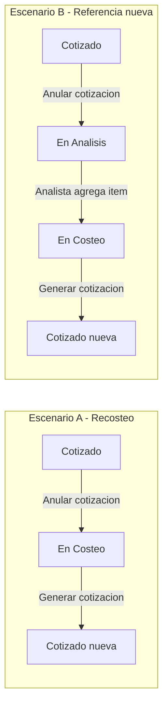

# Módulo de Pedidos y Cotizaciones

Este módulo gestiona el corazón comercial de HeavyMarket: desde la intención de compra del cliente hasta la generación de la cotización formal.

## 1. Flujo de Trabajo (Workflow)

**Nota sobre `Enviado`:** Hoy significa **despacho físico al cliente** (post-aprobacion). El uso historico de `Enviado` como "cotizacion enviada al cliente" esta **deprecado**; esa fase ya no existe en el pipeline comercial.

### Devoluciones desde Cotizado (decision 2026-06-13)

Al devolver desde `Cotizado`, la **cotizacion vigente se anula** (`Anulada`). Al llegar de nuevo a `Cotizado`, se **crea una cotizacion nueva** via `finalizarCosteo`. No hay versionado numerico por ahora (oportunidades comerciales: decision diferida con el cliente).

| Escenario | Transicion | Motivo tipico |
|-----------|------------|---------------|
| Ajuste precios/proveedor sin items nuevos | `Cotizado` -> `En_Costeo` | Recosteo, mismo alcance de referencias |
| Referencia olvidada / cambio de alcance | `Cotizado` -> `En_Analisis` | Solo el analista agrega o corrige items en `/analysis` |

---

## 2.1 Reglas transversales de edicion

### Dominios de mutacion (tres ejes)

| Dominio | Vista / API | Quien | Estados habilitados |
|---------|-------------|-------|---------------------|
| Edicion comercial | `/pedidos/:id/edit`, `PUT /pedidos/{id}` | Vendedor (propio), Admin | **`Nuevo` unicamente** |
| Edicion de items/referencias | `/pedidos/:id/analysis` | **Analista** | **`En_Analisis` unicamente** |
| Edicion de costeo | `/pedidos/:id/costeo`, `POST guardar-costeo` | Vendedor, Admin | **`En_Costeo`** |
| Documento cotizacion | `/app/cotizaciones/...` | Vendedor, Admin | Tras generacion; ver estado `Cotizado` |
| Decision cliente | `POST responder` | Vendedor, Administrador, super_admin | **`Cotizado`** |
| Despacho | `POST enviar` | Logistica, Administrador, super_admin | **`Aprobado`** |
| Entrega | `POST entregar` | Logistica, Administrador, super_admin | **`Enviado`** |

**Regla de oro:** Despues de `En_Analisis`, **nadie** agrega o modifica items desde `/edit`. Si el cliente pide una referencia olvidada despues de cotizar, el flujo es **devolver al analista** (no reabrir `/edit`).

### Estados de solo lectura total (decision 2026-06-13)

Desde **`Cotizado` en adelante** (`Cotizado`, `Aprobado`, `Rechazado`, `Enviado`, `Entregado`, `Cancelado`), **ningun rol** puede mutar el pedido por ninguna via de edicion:

| Capa bloqueada | Rutas / acciones |
|----------------|------------------|
| Edicion comercial | `/pedidos/:id/edit`, icono lapiz en listado/detalle, `PUT /pedidos/{id}` |
| Edicion de items | `/pedidos/:id/analysis` |
| Edicion de costeo | `/pedidos/:id/costeo`, `POST guardar-costeo` |
| UI | Ocultar botones e iconos de editar en listado, detalle y sidebars |

Las unicas mutaciones permitidas en estos estados son **transiciones de flujo** via endpoints dedicados (aprobar, rechazar, devolver, enviar, entregar, cancelar).

### Flujo post-Cotizado — Opcion A (decision 2026-06-13)

| Paso | Estado pedido | Que ocurre |
|------|---------------|------------|
| 1 | `Cotizado` | Espera decision del cliente |
| 2 | `Aprobado` | Decision comercial registrada; se genera OT/OC (unificar en una transaccion) |
| 3 | — | Logistica opera en modulo OT (semaforos, recepcion proveedor, despacho) |
| 4 | `Enviado` | Logistica o Admin confirma despacho al cliente (`POST enviar`) |
| 5 | `Entregado` | Logistica o Admin confirma entrega (`POST entregar`) — **estado final feliz** |

`Aprobado` **no** implica que el pedido ya salio; solo que el cliente acepto. El avance a `Enviado` es accion de despacho posterior.

### Cotizaciones: activa vs anulada

| Concepto | Regla |
|----------|-------|
| Cotizacion activa | Maximo **una** por pedido en `Enviada` o `Borrador` |
| Al devolver desde `Cotizado` | Cotizacion activa pasa a **`Anulada`** (motivo + usuario + fecha) |
| Nueva cotizacion | Se crea al **finalizar costeo** (flujo existente) |
| `Rechazada` vs `Anulada` | `Rechazada` = decision del cliente; `Anulada` = correccion interna del flujo |

### Decisiones diferidas

| Tema | Estado | Notas |
|------|--------|-------|
| Versionado de cotizaciones (v1, v2) | Diferido | Consultar con cliente si vale oportunidades comerciales |
| Pedido como contenedor de oportunidad | Diferido | Cambio de paradigma comercial |
| Devolver desde `Aprobado` con OT generada | Fuera de alcance inicial | Requiere reglas de logistica |
| Significado legacy de `Enviado` | Deprecado | Antes = cotizacion enviada; hoy = despacho al cliente |
| Reabrir desde `Rechazado` | No permitido | Estado final; crear pedido nuevo si el cliente vuelve |
| Unificar aprobacion pedido + cotizacion + OT | Pendiente implementacion | Hoy existen dos caminos inconsistentes en codigo |
| Roles para `enviar` / `entregar` | **Cerrado** | Logistica, Administrador, super_admin |

---

## 2. Características Clave
- **Wizard de Creación**: Proceso guiado para asociar cliente, máquinas y referencias.
- **Análisis de Referencias**: Limpieza y validación de ítems antes de enviar a proveedores.
- **Cuadro Comparativo**: Selección inteligente del mejor proveedor por precio y tiempo.
- **TRM Dinámica**: Conversión automática de precios basada en la tasa del día.

---

## 🛠️ Mapa de Implementación (Anclas Técnicas)

Para dominar el flujo de Pedidos y Cotizaciones, consulte estos archivos:

1. **El Contrato (Backend Model)**: 
   - `heavy-api/app/Models/Pedido.php` (Estados y trazabilidad).
   - `heavy-api/app/Models/Cotizacion.php` (Resultante del proceso de costeo).
2. **El Cerebro (API Controller)**: 
   - `heavy-api/app/Http/Controllers/Api/V1/PedidoController.php` (Orquestador del flujo).
   - `heavy-api/app/Http/Controllers/Api/V1/CotizacionController.php` (Generación de PDFs y aprobación).
3. **El Transporte (Frontend DTO)**: `heavy-front/src/app/core/models/pedido.model.ts` (Interfaces complejas con referencias anidadas).
4. **La Fachada (State Management)**: `heavy-front/src/app/store/pedidos/` (Efectos y reducers para el flujo multi-paso).
5. **La Interaccion (Feature UI)**: 
   - `heavy-front/src/app/features/pedidos/analysis/` (Pantalla de limpieza de datos — **unico lugar para editar items post-Nuevo**).
   - `heavy-front/src/app/features/pedidos/costeo/` (Costeo y generacion de cotizacion).
   - `heavy-front/src/app/features/cotizaciones/` (Documento formal; devoluciones desde detalle).
6. **Utilidades transversales (Frontend)**:
   - `heavy-front/src/app/core/utils/pedido-edicion-comercial.ts` (Estados sin `/edit` comercial).
7. **Devoluciones desde Cotizado (Backend — por implementar)**:
   - `heavy-api/app/Enums/PedidoEstado.php` (transiciones `Cotizado` -> `En_Costeo`, `En_Analisis`).
   - `heavy-api/app/Services/CotizacionService.php` (`anularCotizacionActiva`).
   - `heavy-api/app/Http/Controllers/Api/V1/PedidoController.php` (`devolver-a-costeo`, devolver analista desde cotizado).
   - `heavy-api/routes/api.php`.
8. **Harness**: `.harness/dag.json` issue `pedidos-cotizado-devoluciones`.

---

## 3. Matriz Estado x Rol (Documento Vivo)

### Convenciones de Nomenclatura
- Estados del enum backend: `Borrador`, `Nuevo`, `En_Analisis`, `Enviado`, `En_Costeo`, `Cotizado`, `Aprobado`, `Entregado`, `Rechazado`, `Cancelado`.
- En templates se usa el valor exacto del enum (ej. `pedido.estado !== 'Nuevo'`).
- Roles: `Vendedor`, `Analista`, `Administrador`, `super_admin`, `Logistica`.

---

### Estado: Nuevo

**Descripcion**: Pedido completado y listo para ser asignado a un analista. Es el primer estado formal tras salir de Borrador.

#### Vista Detalle (`detail.html` / `detail.ts`)

| Elemento | Comportamiento | Justificacion |
|----------|---------------|---------------|
| Boton Imprimir | Oculto | Prematuro; el pedido aun no tiene cotizacion ni analisis |
| Boton Generar Cotizacion (sidebar) | Oculto | Decorativo sin handler; la cotizacion se genera tras el costeo |
| Boton Analizar Pedido | Visible para Analista/Admin | Permite transicion a En_Analisis |
| Boton Costear Pedido | Visible para Vendedor/Admin si estado = En_Costeo | No aplica en Nuevo, pero el boton existe para otros estados |
| Boton Editar Pedido | Visible segun `puedeEditarPedido()` | Vendedor puede editar si no esta en En_Analisis |
| Fallback "Item Requerido #N" | Usa `$index + 1` (posicion en lista) | El PK `item.id` era confuso; la posicion ordinal es mas legible |

#### Reglas de Rol en Estado Nuevo

| Rol | Ver Detalle | Editar | Analizar | Costear |
|-----|------------|--------|----------|---------|
| Vendedor | Si (solo propios) | Si | No | No |
| Analista | Si | No | Si | No |
| Administrador | Si | Si | Si | Si |
| super_admin | Si | Si | Si | Si |
| Logistica | Si | Si | No | No |

#### Archivos Afectados
- `heavy-front/src/app/features/pedidos/detail/detail.html`
- `heavy-front/src/app/features/pedidos/detail/detail.ts`

---

### Estado: En_Analisis

**Descripcion**: Pedido asignado al analista para limpieza y validacion de referencias. El vendedor consulta en detalle (solo lectura); el analista trabaja en la ruta `/analysis`.

#### Vista Detalle (`detail.html` / `detail.ts`) — consulta durante analisis

| Elemento | Comportamiento | Justificacion |
|----------|---------------|---------------|
| Boton Imprimir | Oculto | Aun no hay cotizacion; el pedido esta en revision |
| Boton Generar Cotizacion (sidebar) | Oculto | Decorativo sin handler; cotizacion se genera tras costeo |
| Boton Analizar Pedido | Visible para Analista/Admin | Acceso a la vista de trabajo `/analysis` |
| Boton Editar Pedido | Segun `puedeEditarPedido()` | Vendedor bloqueado; admin/logistica pueden mutar |

#### Vista Analisis (`analysis.html`)

| Elemento | Comportamiento | Justificacion |
|----------|---------------|---------------|
| Boton Imprimir | No existe en plantilla | N/A |
| Boton Generar Cotizacion | No existe en plantilla | N/A |
| Guardar / Pasar a costeo / Devolver | Segun rol y completitud de items | Flujo operativo del analista |

#### Archivos Afectados
- `heavy-front/src/app/features/pedidos/detail/detail.html`
- `heavy-front/src/app/features/pedidos/detail/detail.ts`

---

### Estado: En_Costeo

**Descripcion**: Pedido con referencias analizadas; el vendedor/asesor asigna proveedores y precios. La edición comercial (`/edit`) está cerrada para **todos los roles**, incluidos Administrador y super_admin.

#### Vista Detalle (`detail.html` / `detail.ts`)

| Elemento | Comportamiento | Justificacion |
|----------|---------------|---------------|
| Boton Imprimir | Oculto | Sin cotización formal aún |
| Boton Generar Cotizacion (sidebar) | Oculto | Se genera desde `/costeo` |
| Boton Editar Pedido | Oculto (todos los roles) | Usar `/costeo`; cambios estructurales vía devolver al analista |
| Boton Costear Pedido | Visible para Vendedor/Admin | Acceso a `/costeo` |

#### Vista Listado (`pedidos-list.component.ts`)

| Elemento | Comportamiento |
|----------|---------------|
| Icono lapiz (editar) | Oculto (solo aplica en `Nuevo`) |
| Clic en fila | Redirige a `/costeo` |

#### Rutas y API

| Capa | Regla |
|------|-------|
| Guard `/edit` | Redirige a `/costeo` si estado = `En_Costeo` (sin excepción admin) |
| `PedidoPolicy::editComercial` | Deniega PUT comercial en `En_Costeo` |
| `PedidoPolicy::update` | Permite `guardar-costeo`, devoluciones, etc. |
| Policy method | `editComercial` en `UpdatePedidoRequest` |

#### Archivos Afectados
- `heavy-front/src/app/features/pedidos/guards/pedido-vendedor-solo-lectura-en-analisis.guard.ts`
- `heavy-front/src/app/core/utils/pedido-edicion-comercial.ts`
- `heavy-api/app/Policies/PedidoPolicy.php`
- `heavy-api/app/Http/Requests/UpdatePedidoRequest.php`

---

### Estado: Cotizado

**Descripcion**: Cotizacion formal generada (`finalizarCosteo`). El pedido espera decision del cliente (aprobar/rechazar) o correccion interna via devolucion.

#### Vista Detalle (`detail.html` / `detail.ts`)

| Elemento | Comportamiento | Justificacion |
|----------|---------------|---------------|
| Boton Imprimir | Visible | Documento disponible |
| Boton Generar Cotizacion (sidebar) | **Oculto** | Ya existe cotizacion; evitar confusion |
| Boton Editar Pedido | **Oculto (todos los roles)** | Edicion comercial cerrada; items solo en analisis |
| Boton Costear Pedido | Oculto | No aplica |
| **Devolver a costeo** | Visible Vendedor/Admin | Escenario A: recosteo sin items nuevos |
| **Devolver al analista** | Visible Vendedor/Admin | Escenario B: referencia olvidada |
| Aprobar / Rechazar | Vendedor, Administrador, super_admin | Decision del cliente via `POST responder` |

#### Vista Cotizaciones (`cotizaciones/detail`)

| Elemento | Comportamiento |
|----------|---------------|
| Cotizacion activa | Muestra acciones de envio/PDF segun estado |
| Devolver a costeo / analista | Espejo o enlace al pedido (por definir en UI) |
| Cotizacion `Anulada` | Solo lectura / historico |

#### Efecto en cotizacion al devolver

1. Buscar cotizacion activa del pedido (`Enviada` o `Borrador`).
2. Marcar como **`Anulada`** con comentario obligatorio.
3. Transitar pedido a `En_Costeo` o `En_Analisis`.
4. Al regenerar: nueva fila en `cotizaciones` (sin versionado).

#### Rutas y API (implementado 2026-06-13)

| Capa | Regla | Estado |
|------|-------|--------|
| `PedidoEstado` | `Cotizado` -> `En_Costeo`, `En_Analisis` | Implementado |
| `POST pedidos/{id}/devolver-a-costeo` | Anula cotizacion + transita | Implementado |
| `POST pedidos/{id}/devolver-analista` | Ampliado para origen `Cotizado` | Implementado |
| Guard `/edit` | Bloquea `Cotizado` (todos los roles) | Implementado |
| `editComercial` | Deniega `Cotizado` y estados posteriores | Implementado |
| `CotizacionService::anularCotizacionActiva` | Busca `Enviada`/`Borrador` y marca `Anulada` | Implementado |

#### Reglas de Rol en Estado Cotizado

| Rol | Ver | Editar comercial | Devolver costeo | Devolver analista | Aprobar/Rechazar |
|-----|-----|------------------|-----------------|-------------------|------------------|
| Vendedor (propio) | Si | No | Si | Si | Si |
| Analista | Si (listado) | No | No | No | No |
| Administrador | Si | No | Si | Si | Si |
| super_admin | Si | No | Si | Si | Si |

**Aprobar/Rechazar:** Los tres roles comerciales (`Vendedor` del pedido, `Administrador`, `super_admin`) pueden registrar la decision del cliente. `Analista` no.

#### Archivos implementados (DAG `pedidos-cotizado-devoluciones`)

**Backend:**
- `heavy-api/app/Enums/PedidoEstado.php` — Transiciones `Cotizado` -> `En_Costeo`, `En_Analisis`
- `heavy-api/app/Services/CotizacionService.php` — Metodo `anularCotizacionActiva()`
- `heavy-api/app/Http/Controllers/Api/V1/PedidoController.php` — `devolverACosteo()`, `devolverAAnalista()` ampliado
- `heavy-api/app/Policies/PedidoPolicy.php` — `editComercial` bloquea Cotizado+
- `heavy-api/routes/api.php` — Ruta `devolver-a-costeo`
- `heavy-api/tests/Feature/Api/PedidoDevolverDesdeCotizadoTest.php` — 11 tests passing

**Frontend:**
- `heavy-front/src/app/core/utils/pedido-edicion-comercial.ts` — `ESTADOS_SIN_EDICION_COMERCIAL` extendido
- `heavy-front/src/app/core/services/pedido.service.ts` — `devolverACosteo()`, `devolverAAnalista()`
- `heavy-front/src/app/features/pedidos/detail/detail.ts` — Botones + dialog de devolucion
- `heavy-front/src/app/features/pedidos/detail/detail.html` — UI botones + dialog
- `heavy-front/src/app/features/cotizaciones/detail/detail.component.ts` — Banner Anulada + acciones ocultas
- `heavy-front/e2e/pedido-devolver-desde-cotizado.spec.ts` — Tests E2E con mocks

---

### Estado: Aprobado

**Descripcion**: El cliente acepto la cotizacion. Decision comercial cerrada. La ejecucion logistica ocurre en el modulo **Orden de Trabajo** en paralelo al estado del pedido.

#### Transiciones validas

| Destino | Disparador | Notas |
|---------|------------|-------|
| `Enviado` | Despacho confirmado (`POST enviar`) | Significa salida hacia el cliente |
| `Cancelado` | Cancelacion interna | Fuera de flujo feliz |

#### Solo lectura

| Capa | Regla |
|------|-------|
| `/edit`, `/analysis`, `/costeo` | Bloqueados **todos los roles** |
| Iconos lapiz / botones editar | Ocultos |
| Acciones permitidas | Ver, imprimir, ir a OT/cotizacion; **Marcar Enviado** (Logistica, Administrador, super_admin) |

#### Efecto colateral al aprobar (objetivo unificado)

1. Pedido -> `Aprobado`
2. Cotizacion activa -> `Aprobada`
3. Crear **Orden de Trabajo** y **Orden de Compra** (hoy solo en `CotizacionService::aprobar`; pendiente unificar con `responder`)

#### Reglas de Rol

| Rol | Ver | Editar (cualquier dominio) | Aprobar/Rechazar | Marcar Enviado |
|-----|-----|---------------------------|------------------|----------------|
| Vendedor (propio) | Si | No | No (ya aprobado) | No |
| Administrador | Si | No | No | **Si** |
| super_admin | Si | No | No | **Si** |
| Analista | No (fuera de En_Analisis) | No | No | No |
| Logistica | Si (via OT / pedido) | No | No | **Si** |

---

### Estado: Enviado

**Descripcion**: Despacho al cliente confirmado. **No confundir** con el significado deprecado ("cotizacion enviada").

#### Transiciones validas

| Destino | Disparador |
|---------|------------|
| `Entregado` | Entrega confirmada (`POST entregar`) |
| `Cancelado` | Cancelacion excepcional |

#### Solo lectura

Misma regla que `Aprobado`: ningun rol edita comercial, items ni costeo.

#### Reglas de Rol

| Rol | Ver | Editar | Marcar Entregado |
|-----|-----|--------|------------------|
| Vendedor | Si | No | No |
| Administrador | Si | No | **Si** |
| super_admin | Si | No | **Si** |
| Logistica | Si | No | **Si** |
| Analista | No | No | No |

---

### Estado: Entregado

**Descripcion**: Entrega al cliente confirmada. **Estado final** del flujo feliz (junto con ramas de cancelacion/rechazo).

| Capa | Regla |
|------|-------|
| Mutaciones | Ninguna via de edicion |
| Transiciones | Ninguna (estado terminal) |

---

### Estado: Rechazado

**Descripcion**: El cliente rechazo la cotizacion. **Estado final** — no se reabre ni se devuelve a costeo/analisis.

#### Transiciones validas

Ninguna (estado terminal en `PedidoEstado`).

#### Solo lectura

| Capa | Regla |
|------|-------|
| `/edit`, `/analysis`, `/costeo` | Bloqueados todos los roles |
| Devolver a costeo/analista | **No permitido** |
| Reabrir pedido | **No** — crear pedido nuevo si el cliente reconsidera |

#### Reglas de Rol en rechazo (registro de la decision)

| Rol | Puede rechazar desde `Cotizado` |
|-----|--------------------------------|
| Vendedor (propio) | Si |
| Administrador | Si |
| super_admin | Si |
| Analista | No |

#### Cotizacion asociada

Al rechazar via `POST responder`, la cotizacion activa debe quedar en estado **`Rechazada`** (decision del cliente, distinto de `Anulada`).

---

### Resumen: bloqueo de edicion por fase

| Estado | `/edit` | `/analysis` | `/costeo` | Lapiz listado |
|--------|---------|-------------|-----------|---------------|
| `Nuevo` | Si (vendedor/admin) | No | No | Si |
| `En_Analisis` | No | Si (analista) | No | No |
| `En_Costeo` | No | No | Si (vendedor/admin) | No |
| `Cotizado`+ | **No** | **No** | **No** | **No** |

---

**Ultima actualizacion:** 13 de Junio, 2026 — Devoluciones desde Cotizado implementadas (endpoints, UI, tests, documentacion).
