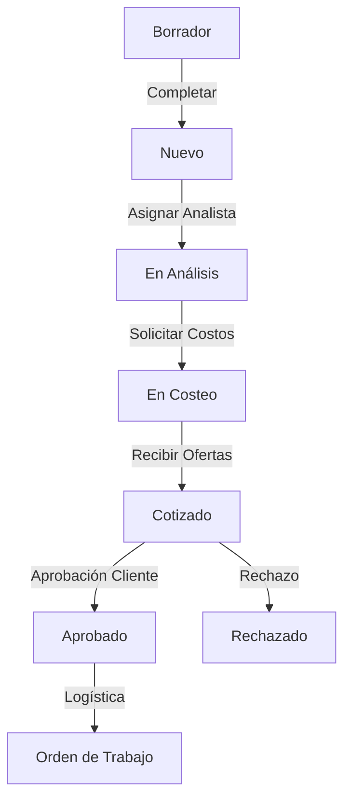

# Módulo de Pedidos y Cotizaciones

Este módulo gestiona el corazón comercial de HeavyMarket: desde la intención de compra del cliente hasta la generación de la cotización formal.

## 1. Flujo de Trabajo (Workflow)

## 2. Características Clave
- **Wizard de Creación**: Proceso guiado para asociar cliente, máquinas y referencias.
- **Análisis de Referencias**: Limpieza y validación de ítems antes de enviar a proveedores.
- **Cuadro Comparativo**: Selección inteligente del mejor proveedor por precio y tiempo.
- **TRM Dinámica**: Conversión automática de precios basada en la tasa del día.

---

## 🛠️ Mapa de Implementación (Anclas Técnicas)

Para dominar el flujo de Pedidos y Cotizaciones, consulte estos archivos:

1. **El Contrato (Backend Model)**: 
   - `heavy-api/app/Models/Pedido.php` (Estados y trazabilidad).
   - `heavy-api/app/Models/Cotizacion.php` (Resultante del proceso de costeo).
2. **El Cerebro (API Controller)**: 
   - `heavy-api/app/Http/Controllers/Api/V1/PedidoController.php` (Orquestador del flujo).
   - `heavy-api/app/Http/Controllers/Api/V1/CotizacionController.php` (Generación de PDFs y aprobación).
3. **El Transporte (Frontend DTO)**: `heavy-front/src/app/core/models/pedido.model.ts` (Interfaces complejas con referencias anidadas).
4. **La Fachada (State Management)**: `heavy-front/src/app/store/pedidos/` (Efectos y reducers para el flujo multi-paso).
5. **La Interacción (Feature UI)**: 
   - `heavy-front/src/app/features/pedidos/analysis/` (Pantalla de limpieza de datos).
   - `heavy-front/src/app/features/cotizaciones/` (Gestión de documentos finales).

---
**Última actualización:** 17 de Mayo, 2026
