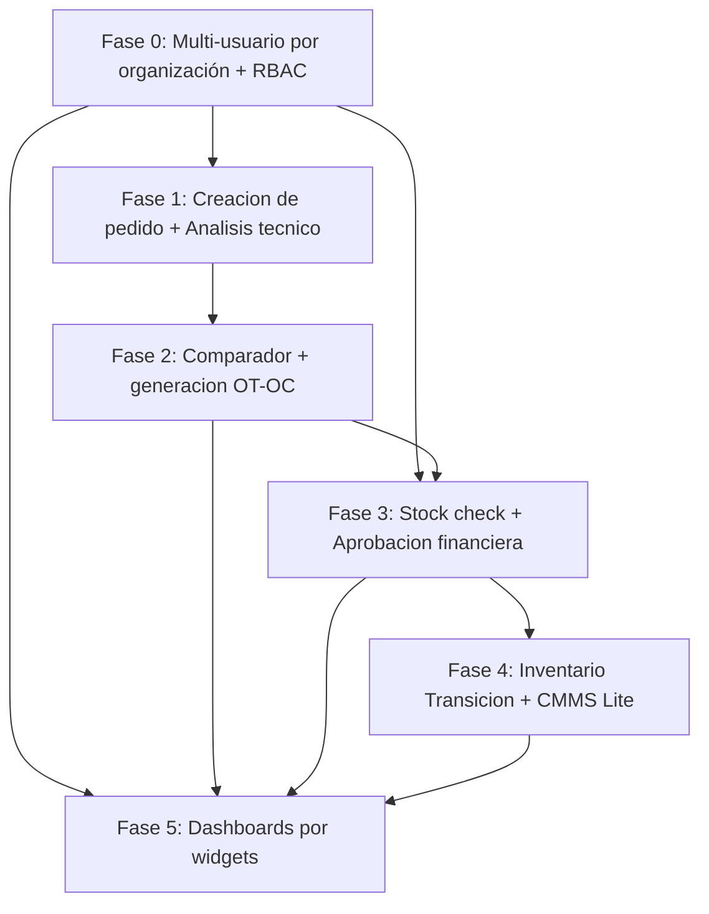

# Plan de Refactorización — Heavy Market Multi-Rol (PRD Octubre 2026)

> Documento vivo. Basado en `docs/prd_heavy_market.md`. Objetivo: dividir la refactorización completa (RBAC multi-tenant, máquina de estados, CMMS Lite, dashboards por widget) en fases ejecutables de forma incremental sobre `dev`, validables en el servidor de staging antes de tocar `main`/producción.

## 1. Auditoría técnica previa (qué ya existe vs qué es nuevo)

Antes de planear fases hay que partir de la implementación real, no de cero. Hallazgos:

### 1.1 Máquina de estados: ya existe y cubre ~70% del flujo del PRD

| Estado PRD | Estado real ya implementado | Dónde |
|---|---|---|
| `DRAFT` / `PENDING_ANALYSIS` | `Borrador`, `Nuevo`, `En_Analisis` (`PedidoEstado`) | `heavy-api/app/Enums/PedidoEstado.php` |
| `RFQ_BROADCAST` / `QUOTING` | `En_Costeo` (múltiples cotizaciones por pedido) | `CotizacionService` |
| `READY_FOR_REVIEW` | `Cotizado` → `Aprobado` (genera OT+OC) | `CotizacionService::aprobar()` |
| `PO_STOCK_CHECK` | `PendienteRevisionStock` / `StockIncompleto` | `OrdenCompraEstado` |
| `PO_PENDING_APPROVAL` | `EnEsperaAprobacionGerencial` / `DevueltaPorGerencia` | `OrdenCompraEstado` |
| `PAYMENT_UPLOADED` | `PendienteDePago` → `PagadaListaDespacho` | `OrdenCompraEstado` |
| `SHIPPED` | `EnTransito` / `Despachada` | `OrdenCompraEstado` |
| `DELIVERED` | `Recibida` / `EntregadaCerrada` | `OrdenCompraEstado` + recepciones vía OT |
| `IN_STOCK` / `INSTALLED` | **No existe** | — |

**Conclusión:** `OrdenCompraEstado` ya modela casi literalmente el ciclo PO_STOCK_CHECK → PO_PENDING_APPROVAL → PAYMENT_UPLOADED → SHIPPED → DELIVERED del PRD. No hay que rediseñar la máquina de estados, hay que **re-cablear qué rol dispara cada transición** y rellenar el tramo final (`IN_STOCK`/`INSTALLED`) que no existe.

### 1.2 Roles actuales (Spatie) vs roles requeridos por el PRD

| Rol PRD | Rol actual más cercano | Gap |
|---|---|---|
| Gestor de Maquinaria (Org A) | — (hoy lo hace `Vendedor`, rol interno de HM) | Nuevo rol, nuevo dueño de la UI de carrito/catálogo |
| Gerente — Aprobador financiero (Org A) | `Gerente Comercial` (existe, subutilizado) | Reasignar vista simplificada de aprobación OC |
| Contador (Org A) | `Contabilidad` (existe) | Flujo de "subir comprobante" no está acotado a este rol |
| Almacenista (Org A) | `Logistica` (existe, rol único para todo) | Hay que separar recepción+Remisión de Salida de logística de despacho |
| **Administración (Org A y B, nuevo, no está en el PRD original)** | — | Rol scoped-a-empresa para dar de alta/baja usuarios de su propio `Tercero`; ver sección 1.3.1 |
| Vendedor / Facturador / Logística (Org B) | `Proveedor` (rol único, sin sub-roles) | Falta granularidad dentro del portal de proveedor |
| Analista Técnico (Org C) | `Analista` (existe, ya hace cruce de referencias) | Encaja casi 1:1, solo falta que no vea precios |
| Vendedor Broker (Org C) | — | Nuevo: calculadora omnicanal de costeo |
| Gerente / Contabilidad / Logística (Org C) | `Administrador` / `super_admin` genéricos | Sin separación interna hoy |

### 1.3 Hallazgo crítico (bloqueante para todo lo demás): modelo 1 Usuario = 1 Tercero

Hoy `tercero.user_id` es una relación **uno a uno**: cada login de Cliente o Proveedor crea su propio registro de `Tercero` (`ClientAuthController::register`, `ProviderAuthController::register`). **No existe ningún mecanismo para que varios usuarios (Gestor, Gerente, Contador, Almacenista) pertenezcan a la misma empresa cliente.**

El PRD asume por diseño que una empresa cliente tiene **4 usuarios distintos con 4 roles distintos**, y una empresa proveedora tiene **3 usuarios distintos con 3 roles distintos**. Esto no es un ajuste de permisos: es pasar de *1 usuario = 1 empresa* a *N usuarios = 1 empresa*.

**¿Cuál es "la empresa" (tenant) en este modelo?** Se evaluó reutilizar el recurso `Empresa` (`heavy-api/app/Models/Empresa.php`) y se descartó: es un **singleton** — su `boot()` desactiva automáticamente cualquier otra empresa cada vez que una se guarda con `estado = true` ("solo una empresa activa a la vez"). Representa a Heavy Market como operador (logo, NIT, representante legal, TRM, flete de referencia), no a empresas cliente/proveedoras múltiples y coexistentes.

El tenant correcto ya existe: **`Tercero`** (`tipo` = `Cliente`/`Proveedor`, con `direcciones`, `contactos`, `maquinas` ya colgando de él). Es, de hecho, el registro de "la empresa cliente" o "la empresa proveedora" tal cual el PRD lo necesita. Lo que falta es una tabla de membresía (`tercero_user`: `tercero_id`, `user_id`, `rol_en_organizacion`) que reemplace el `user_id` 1:1 actual, de modo que **un Tercero tenga N usuarios**, cada uno con su propio rol dentro de esa organización.

**Esta es la pieza arquitectónica más grande y riesgosa del proyecto.** Todo lo demás (quién ve qué widget, quién aprueba qué OC) depende de que esto exista primero. Se marca como ítem de validación obligatoria con `software_architect` antes de tocar código.

**Requisito transversal confirmado (2026-10-08):** no basta con repartir pantallas por rol — cada empresa (`Tercero`) debe quedar completamente aislada de las demás en usuarios, acciones/auditoría, pedidos y estadísticas. Esto significa que las consultas que hoy filtran "lo mío" por `user_id` (pedidos, cotizaciones, órdenes de compra, KPIs) deben pasar a filtrar por el `tercero_id` resuelto de la sesión del usuario autenticado, para que todos los usuarios de la misma empresa compartan exactamente la misma vista de datos y nunca vean los de otra empresa. No es opcional, es condición de cierre de la Fase 0.

### 1.3.1 Nuevo rol: Administración (por empresa)

Para que el modelo N-usuarios-por-empresa funcione sin que Heavy Market tenga que dar de alta manualmente a cada usuario, se agrega un rol **"Administración"**, **scoped a su propia empresa** (no es un rol global): quien lo tiene puede ver, crear, editar y desactivar los demás usuarios de su mismo `Tercero`, asignándoles el rol funcional que corresponda (Gestor de Maquinaria / Gerente / Contador / Almacenista en Org A; Vendedor / Facturador / Logística en Org B).

- Es **transversal**, no reemplaza a los roles funcionales: el primer usuario que se autoregistra para una empresa nueva recibe `Administración` **además** de su rol funcional (normalmente Gestor de Maquinaria en Org A, o el equivalente de "dueño de cuenta" en Org B) — no se le obliga a renunciar a su trabajo operativo por administrar el equipo.
- **Atención a nomenclatura:** ya existe un rol Spatie global `Administrador` (interno de Heavy Market, super-usuario de toda la plataforma — Org C). `Administración` es un concepto completamente distinto: vive *dentro* de un `Tercero` y solo ve/gestiona usuarios de **esa** empresa. Hay que dejar esto explícito en el seeder de roles y en cualquier guard de UI/permiso para que no se confundan por el nombre parecido (a validar el nombre final con `software_architect` antes de implementar, para evitar ambigüedad futura).

### 1.4 100% nuevo desarrollo
- Inventario de Transición (tabla/estado `IN_STOCK`).
- Remisión de Salida (formulario con 4 campos obligatorios: máquina, horómetro, foto, responsable).
- `Machine_Ledger` (costo por hora).
- Dashboard `/dashboard` por widgets con renderizado condicional — hoy cada rol navega a rutas monolíticas (`/pedidos`, `/ordenes-compra`, etc.), no hay contenedor de widgets.

---

## 2. Fases propuestas



### Fase 0 — Fundación multi-usuario y RBAC
**Objetivo:** que `Tercero` (la empresa cliente o proveedora) pase de tener un único usuario 1:1 a tener **N usuarios con roles distintos**, vía tabla de membresía `tercero_user` (`tercero_id`, `user_id`, `rol_en_organizacion`). Flujo: primero existe/se crea el `Tercero` (la empresa), luego se crean usuarios asociados a ese `Tercero` con su rol (Gestor, Gerente, Contador, Almacenista en Org A; Vendedor, Facturador, Logística en Org B), más el rol transversal `Administración` (sección 1.3.1) para quien gestiona el equipo de esa empresa. Login resuelve usuario → tercero(s) a los que pertenece → rol(es) dentro de cada uno, en vez de un rol global único. Toda consulta de datos (pedidos, cotizaciones, OC, estadísticas) queda filtrada por el `tercero_id` de la sesión, no por `user_id` — aislamiento completo entre empresas (ver "Requisito transversal" en 1.3). Se crean también los roles Spatie faltantes (Gestor de Maquinaria, Almacenista, Administración, Vendedor Broker, y sub-roles de Org C).
**Decisión confirmada (2026-10-08):** autoregistro. El primer usuario que se registra para una empresa nueva crea su `Tercero`, recibe su rol funcional **y además** el rol `Administración` dentro de ese `Tercero`; desde ahí gestiona (crea/edita/desactiva) a los demás usuarios de su empresa en una pantalla nueva "Mi Equipo", sin fricción de invitación manual por parte de Heavy Market.

**Resolución de "a qué empresa pertenece un registro nuevo" (2026-10-08):** dos caminos separados, sin ambigüedad ni inferencia:

1. **Alta de empresa nueva** — `ClientAuthController::register` / `ProviderAuthController::register` (formulario público, igual que hoy). Siempre crea una empresa nueva: `User` + `Tercero` + fila en `tercero_user` con rol `Administración` + rol funcional. No resuelve nada porque es, por definición, "primera vez que esta empresa entra al sistema". La validación `email: unique:users` ya existente rechaza por sí sola a alguien de una empresa ya registrada que use este formulario por error; solo hay que cambiar el mensaje de error a algo como *"ya existe una cuenta con este correo; si tu empresa ya está registrada, pide a tu administrador que te agregue desde Mi Equipo"*.
2. **Alta de un compañero de equipo** — endpoint nuevo, autenticado, solo accesible con rol `Administración`, desde la pantalla "Mi Equipo". El `tercero_id` no se busca ni se adivina: es el de la sesión del admin que hace la petición (resuelto vía `tercero_user`). El admin ingresa nombre/email/rol del compañero; el backend crea el `User` + la fila en `tercero_user` con ese `tercero_id` fijo.

**Mecanismo de alta del compañero invitado (decisión confirmada 2026-10-08): invitación por correo.** El admin solo ingresa nombre/email/rol; el sistema crea el usuario sin contraseña utilizable y envía un correo con link de activación (mismo patrón de "reset password") donde el invitado define su propia contraseña. Se apoya en la infraestructura de correo ya existente en el proyecto (`app/Notifications`, `app/Mail`, usada hoy para `QuoteRequestedClient` y similares) en vez de introducir un mecanismo nuevo. Queda pendiente, cuando se pase a Triage/DAG de esta fase: expiración del link de invitación, reenvío si expira, y qué ve el admin mientras la invitación está "pendiente de aceptar" en la pantalla Mi Equipo.
**Por qué primero:** todas las fases siguientes reasignan pantallas por rol; sin esto no hay "a quién reasignar".
**Riesgo:** Alto — migración de datos de terceros/usuarios existentes (clientes y proveedores reales ya en producción) sin romper sesiones activas.
**Skill obligatoria:** `software_architect` (patrón de membresía org↔usuario) antes de generar el DAG de esta fase.

### Fase 1 — Creación de pedido + Análisis técnico
**Objetivo:** mover la vista de carrito/catálogo/carga masiva del `Vendedor` (HM) al `Gestor de Maquinaria` (Cliente). El Analista Técnico conserva su pantalla de cruce de referencias tal cual.
**Backend:** el botón de envío pasa el pedido a `En_Analisis` (ya existe), solo cambia quién tiene permiso de dispararlo.
**Riesgo:** Medio — es el cambio de UX más visible para el cliente final (primera vez que arma su propio pedido en vez de llamarlo al asesor).

### Fase 2 — Comparador de cotizaciones + generación OT/OC
**Objetivo:** el panel comparador pasa a ser exclusivo del Gestor de Maquinaria. Se reutiliza la lógica ya existente de `CotizacionService::aprobar()` que genera OT+OC automáticamente — no se reescribe.
**Riesgo:** Bajo — es reasignación de permisos sobre lógica ya probada (nodos `cotizacion-aprobacion-*` ya en `done`).

### Fase 3 — Confirmación de stock + Aprobación financiera
**Objetivo:** `PendienteRevisionStock`/`StockIncompleto` pasan a ser tarea exclusiva de Logística (Org B); el Gerente (Org A) no ve la OC en `EnEsperaAprobacionGerencial` hasta que Logística la haya movido ahí. Vista del Gerente se reduce a aprobar/rechazar, sin acceso a búsquedas/cruces.
**Riesgo:** Medio — requiere auditar que el candado de secuencia (stock antes que gerencia) esté realmente forzado en backend y no solo en UI.

### Fase 4 — Inventario de Transición y CMMS Lite
**Objetivo:** al pasar una OC a `Recibida`/`EntregadaCerrada`, inyectar los ítems a un inventario de tránsito (`IN_STOCK`); nuevo formulario de Remisión de Salida (validación de máquina, horómetro numérico, foto obligatoria, responsable) que transiciona a `INSTALLED` y alimenta `Machine_Ledger`.
**Riesgo:** Alto — es 100% desarrollo nuevo (migraciones, modelos, upload de evidencia fotográfica, UI nueva para Almacenista). Candidato fuerte a sub-dividirse en varios nodos atómicos (tabla >3 archivos).

### Fase 5 — Dashboards por widgets
**Objetivo:** reemplazar las vistas monolíticas por un `/dashboard` único con renderizado condicional de widgets por rol (14 combinaciones rol×widget listadas en el PRD, sección 5).
**Por qué al final:** depende de que los roles de las fases 0-4 ya existan y tengan sus propias pantallas/acciones funcionando; los widgets son mayormente contenedores que reutilizan componentes ya reasignados en fases previas (confirmado en el PRD: "los componentes ya programados en React/Tailwind se reutilicen").
**Riesgo:** Medio — mucho volumen de pantallas (14 combinaciones), pero bajo riesgo técnico individual.

---

## 3. Estrategia de ramas

```
main (producción)
 └─ dev (staging — recién creada, apunta a main)
     ├─ feat/fase-0-rbac-multiusuario
     ├─ feat/fase-1-gestor-maquinaria
     ├─ feat/fase-2-comparador-ot-oc
     ├─ feat/fase-3-stock-aprobacion
     ├─ feat/fase-4-cmms-inventario-transicion
     └─ feat/fase-5-dashboards-widgets
```

- `dev` ya existe en `origin` (`git push -u origin dev` hecho), lista para apuntar el servidor de staging.
- `feat/fase-0-rbac-multiusuario` ya existe localmente a partir de `dev`, todavía sin commits — se usará cuando empecemos a implementar la Fase 0, no antes.
- Cada fase se trabaja en su propia rama `feat/fase-N-...` partiendo de `dev`, con PR hacia `dev` (no directo a `main`).
- `dev` se valida en el servidor de staging antes de cada merge hacia `main`.
- Dentro de cada fase, si el nodo dispara la regla de atomicidad (>3 archivos), el Implementer subdivide en sub-nodos (`fase-N.1`, `fase-N.2`, ...) sin pausar, según `AGENTS.md`.

---

## 4. Próximos pasos

**Estado actual: seguimos en levantamiento de información y ajuste de este documento. No se ha creado ningún nodo en `.harness/dag.json` todavía — eso solo pasa cuando cerremos el diseño de la Fase 0.**

1. Seguir revisando y ajustando este documento contigo (roles, alcance, reglas de negocio) hasta que el diseño de la Fase 0 esté cerrado.
2. Cuando lo confirmes, Triage genera los nodos atómicos en `.harness/dag.json` de la Fase 0, con `topic_key` y `required_skill`.
3. Recién ahí arranca el ciclo Triage → Implementer → Reviewer sobre la rama `feat/fase-0-rbac-multiusuario` (ya creada, todavía vacía).
4. `git push` de cada rama de fase, igual que `dev`, se hace cuando lo pidas explícitamente.
