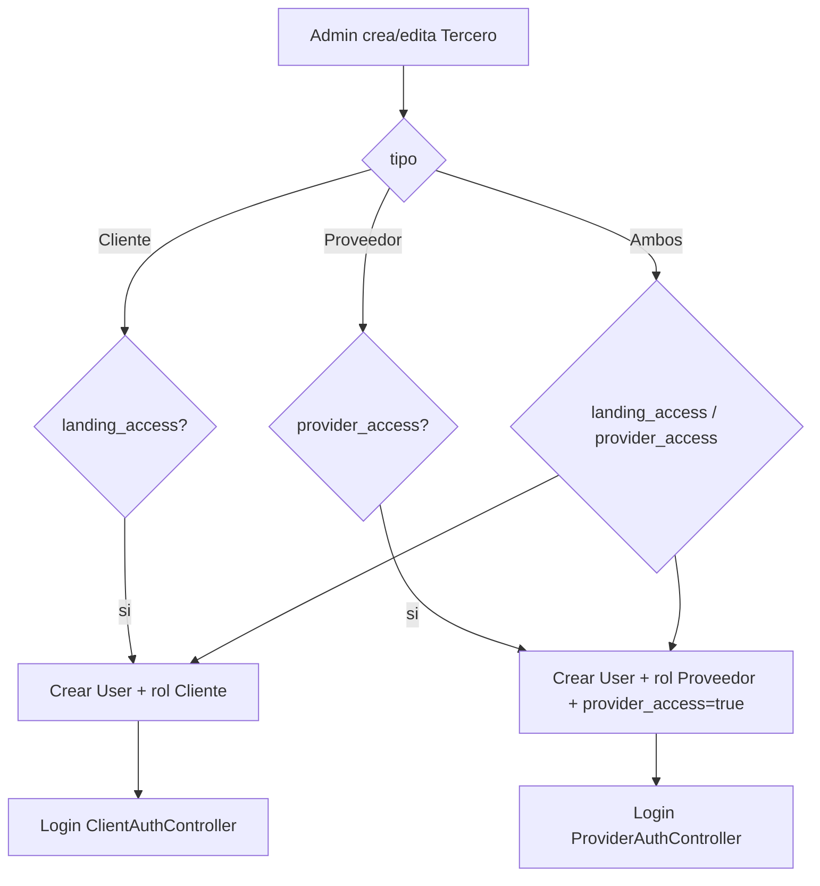

# Portal de Proveedores - Diseño Técnico y Funcional

Este documento describe la arquitectura, el flujo de trabajo y las reglas de negocio para el Portal de Proveedores de HeavyMarket.

## 1. Visión General
El Portal de Proveedores transforma a los proveedores de registros pasivos a colaboradores activos. Su rol principal es participar en el **Costeo Colaborativo** de referencias y gestionar la logística de sus **Órdenes de Compra**.

## 2. Autenticación y Perfil
*   **Mecanismo**: Acceso vía `ProviderAuthController` (API) con un flag `provider_access` en la tabla `terceros`.
*   **Rol (Spatie)**: `Proveedor` (obligatorio para login en el portal).
*   **Especialización**: Un proveedor solo ve referencias que coincidan con sus:
    *   **Marcas** (`tercero_fabricantes` -> `lista_id` tipo 'Fabricantes').
    *   **Categorías Comerciales** (`tercero_categoria_comercial` -> `lista_id` tipo 'Categoría Comercial').

### Alta administrativa vs. registro self-service

| Concepto | Campo / rol | Cuándo aplica |
|----------|-------------|---------------|
| Tipo comercial | `terceros.tipo` = `Proveedor` | Clasificación en inventario y pedidos |
| Acceso landing clientes | `landing_access` + rol `Cliente` | Solo terceros `Cliente` o `Ambos` |
| Acceso portal proveedor | `provider_access` + rol `Proveedor` | Solo terceros `Proveedor` o `Ambos` |

**Regla de oro**: `tipo = Proveedor` **no** implica automáticamente rol Spatie `Proveedor`. El administrador debe activar explícitamente `provider_access` en el CRUD de terceros.

**Bug conocido (corrección en curso)**: `TerceroController::syncLandingUser` asignaba siempre rol `Cliente` al habilitar acceso, incluso en terceros tipo `Proveedor`. La corrección separa los flujos y expone `provider_access` en el formulario administrativo.

## 3. Flujo de Costeo (Preventa)
Cuando un pedido interno pasa al estado `En_Costeo`, se activa el motor de emparejamiento.

### A. Oportunidades de Costeo
1.  **Filtro**: El proveedor ve en su dashboard una lista de `PedidoReferencia` individuales que coinciden con su especialidad.
2.  **Privacidad**: No ve quién es el cliente, ni el pedido completo, ni precios de otros proveedores.
3.  **Datos a Ingresar**:
    *   **Precio de Costo**: (Moneda base del sistema).
    *   **Marca Sugerida**: El proveedor puede proponer una marca diferente (`marca_id`) si la solicitada no está disponible o tiene una mejor opción equivalente.
    *   **Días de Entrega**: Lead time estimado.
4.  **Inmutabilidad**: Una vez enviado el costeo, el proveedor **no puede editarlo**. El registro se bloquea para ese proveedor.

### B. Notificaciones en Tiempo Real
*   **Tecnología**: El portal utiliza **Laravel Reverb** para comunicación vía WebSockets.
*   **Evento**: `NewReferencesAvailable`.
*   **Acción**: Aviso visual instantáneo cuando se publica una referencia que encaja con el perfil del proveedor (Marcas o Categorías).

## 4. Flujo de Órdenes de Compra (Postventa)
Una vez que el cliente final aprueba una cotización, el sistema genera automáticamente una **Orden de Compra (OC)** por proveedor.

1.  **Visibilidad**: El proveedor ve sus OC en estado `Pendiente`.
2.  **Confirmación**: El proveedor debe "Aceptar" la OC para confirmar stock y precio.
3.  **Despacho**:
    *   El proveedor marca como `Despachado`.
    *   Ingresa: Fecha de envío, Transportadora y Número de Guía.
4.  **Recepción**: Marcada ÚNICAMENTE por el personal de logística de HeavyMarket tras verificación física.

## 5. Alcance de Datos y Seguridad
*   **Proveedor**:
    *   Ve: Sus OC, sus ofertas de costo enviadas y referencias disponibles para costear.
    *   NO ve: Datos del cliente final (solo ID de referencia), utilidades de HeavyMarket, precios de la competencia.
*   **Asesor (Vendedor)**:
    *   Ve: Una tabla comparativa de todos los proveedores que costearon una referencia para elegir la mejor opción.

## 6. Modelo de Datos Relacionado
*   `Tercero`: Atributo `provider_access`.
*   `PedidoReferencia`: Estado `En_Costeo`.
*   `PedidoReferenciaProveedor`: Almacena las ofertas de los proveedores.
*   `OrdenCompra`: Documento final generado tras aprobación de cotización.

---

## 🛠️ Mapa de Implementación (Anclas Técnicas)

Para entender la lógica del Portal de Proveedores y el Costeo Colaborativo, consulte:

1. **El Contrato (Backend Model)**: `heavy-api/app/Models/PedidoReferenciaProveedor.php` (Almacena ofertas y selección de marcas).
2. **El Cerebro (API Controller)**: `heavy-api/app/Http/Controllers/Api/V1/PedidoReferenciaProveedorController.php` (Procesa el envío de ofertas).
3. **El Transporte (Frontend DTO)**: `heavy-front/src/app/core/models/pedido.model.ts` (Contiene las interfaces para costeo nacional/internacional).
4. **La Fachada (Frontend Service)**: `heavy-front/src/app/core/services/pedido.service.ts` (Gestión de comparativa de proveedores).
5. **Tiempo Real (Event/Socket)**: `heavy-api/app/Events/NewReferencesAvailable.php` (Dispara avisos vía Laravel Reverb).
6. **Alta administrativa (Terceros)**: `heavy-api/app/Http/Controllers/Api/V1/TerceroController.php` (`syncTerceroPortalUser` / flags `provider_access` y `landing_access`).
7. **Formulario admin (Frontend)**: `heavy-front/src/app/shared/components/tercero-form/` (toggles de acceso separados por tipo).

---
*Última actualización: 17 de Mayo, 2026*
