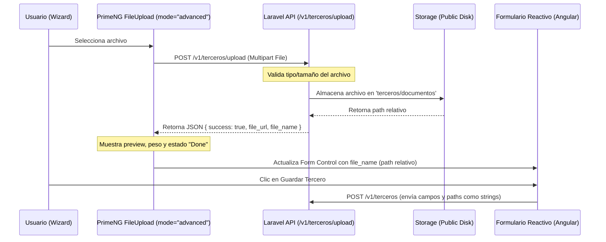

# Manual de Implementación: Indicador Visual de Carga de Documentos de Terceros

Este documento detalla el diseño técnico y la estrategia de implementación para mejorar la experiencia de carga de documentos en el asistente (wizard) de creación y edición de terceros.

---

## 1. Diseño de Arquitectura y Flujo de Datos

El flujo de carga de documentos asíncronos utiliza el componente `p-fileUpload` de PrimeNG en modo avanzado, el cual interactúa directamente con un nuevo endpoint de carga de la API en Laravel.



---

## 2. Especificación del Backend (Laravel)

### Endpoint de Carga Temporal/Individual
- **Ruta**: `POST /v1/terceros/upload`
- **Controlador**: `App\Http\Controllers\Api\V1\TerceroController@uploadDocumento`
- **Middleware**: `auth:sanctum`, `role:Vendedor|super_admin|Administrador`
- **Parámetros Request (multipart/form-data)**:
  - `file`: Archivo (obligatorio, máximo 5MB, tipos: pdf, jpg, jpeg, png).
- **Respuesta JSON Exitosa (200 OK)**:
  ```json
  {
    "success": true,
    "file_url": "/storage/terceros/documentos/nombre_hash.pdf",
    "file_name": "terceros/documentos/nombre_hash.pdf"
  }
  ```

### Modificación de Validación de Terceros
En `StoreTerceroRequest` y `UpdateTerceroRequest`:
- Los campos `rut`, `certificacion_bancaria`, `camara_comercio` y `cedula_representante_legal` deben aceptar tanto un archivo cargado de forma tradicional (para retrocompatibilidad y tests existentes) como un string que representa el path relativo del archivo ya subido mediante el endpoint de carga.
- Regla propuesta:
  ```php
  'rut' => ['nullable', function ($attribute, $value, $fail) {
      if (!is_string($value) && !($value instanceof \Illuminate\Http\UploadedFile)) {
          $fail("El campo $attribute debe ser un archivo o un path de archivo válido.");
      }
  }]
  ```

---

## 3. Especificación del Frontend (Angular 21)

Se modificarán los componentes `tercero-create-modal` y `tercero-form`.

### Integración de PrimeNG FileUpload Avanzado
- **Configuración de Componente**:
  - `mode="advanced"`
  - `url="/api/v1/terceros/upload"`
  - `accept="image/*,application/pdf"`
  - `maxFileSize="5242880"` (5MB)
  - `[auto]="true"` (carga automática al seleccionar)
  - Interceptar cabeceras HTTP de autenticación mediante el token de Sanctum (el FileUpload nativo de PrimeNG debe recibir el token en su atributo `headers` o manejarlo mediante el interceptor HTTP de Angular).

### Estructura de Plantilla en HTML:
```html
<p-fileUpload 
    mode="advanced" 
    [url]="uploadUrl" 
    [headers]="uploadHeaders"
    accept="image/*,application/pdf" 
    maxFileSize="5242880" 
    [auto]="true"
    (onUpload)="onUploadSuccess($event, 'rut')"
    (onError)="onUploadError($event, 'rut')"
    (onRemove)="onUploadRemove('rut')"
>
    <!-- Plantillas personalizadas para mostrar el estado y preview -->
</p-fileUpload>
```

### Visualización y Estados
1. **Preview**: Si es una imagen, mostrar thumbnail. Si es un PDF, mostrar un icono descriptivo de PDF.
2. **Badge de Estado**: 
   - "Pending" mientras la subida está en curso.
   - "Done" cuando la respuesta del servidor es exitosa.
3. **Barra de Progreso**: Integrada por defecto en el layout avanzado de PrimeNG.
4. **Remover archivo**: Al pulsar el botón de eliminar archivo, se debe limpiar el `FormControl` del formulario y actualizar el estado visual.

---

## 4. Soporte de Temas (Claro/Oscuro)

El diseño del indicador visual debe ser coherente con la paleta de colores del proyecto y el soporte de temas claro y oscuro definido en `hm-theme-utilities.scss`:
- Fondo del dropzone y panel de archivos adaptables.
- Textos de tamaño de archivo y nombres legibles sobre fondos oscuros.
- El botón de eliminar y los badges deben integrarse con los estilos de PrimeNG y Tailwind.

---

## 5. Estrategia de Pruebas

### Backend
- Actualizar `TerceroDocumentUploadTest.php` para validar el endpoint `POST /v1/terceros/upload`.
- Validar que el flujo de guardar y actualizar funcione correctamente cuando se envía el path en formato string.

### Frontend
- Verificar visualmente la subida automática en ambos temas.
- Validar la actualización correcta de los Form Controls del formulario de terceros al subir y eliminar archivos.
